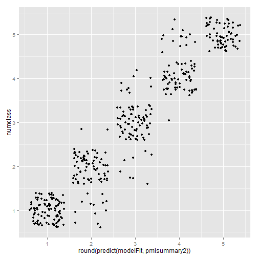
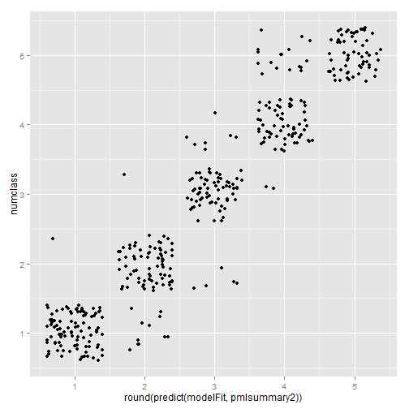

MLproject
========================================================
author: Druce Vertes
date: 5/24/2015

ML Project
========================================================

- Load data from pml-training.csv
Load data
========================================================


```r
library(caret)

# Load data from pml-training.csv
colclasses = c("numeric","character","numeric","numeric","character","character","numeric","numeric","numeric","numeric","numeric","numeric","numeric","numeric","numeric","numeric","numeric","numeric","numeric","numeric","numeric","numeric","numeric","numeric","numeric","numeric","numeric","numeric","numeric","numeric","numeric","numeric","numeric","numeric","numeric","numeric","numeric","numeric","numeric","numeric","numeric","numeric","numeric","numeric","numeric","numeric","numeric","numeric","numeric","numeric","numeric","numeric","numeric","numeric","numeric","numeric","numeric","numeric","numeric","numeric","numeric","numeric","numeric","numeric","numeric","numeric","numeric","numeric","numeric","numeric","numeric","numeric","numeric","numeric","numeric","numeric","numeric","numeric","numeric","numeric","numeric","numeric","numeric","numeric","numeric","numeric","numeric","numeric","numeric","numeric","numeric","numeric","numeric","numeric","numeric","numeric","numeric","numeric","numeric","numeric","numeric","numeric","numeric","numeric","numeric","numeric","numeric","numeric","numeric","numeric","numeric","numeric","numeric","numeric","numeric","numeric","numeric","numeric","numeric","numeric","numeric","numeric","numeric","numeric","numeric","numeric","numeric","numeric","numeric","numeric","numeric","numeric","numeric","numeric","numeric","numeric","numeric","numeric","numeric","numeric","numeric","numeric","numeric","numeric","numeric","numeric","numeric","numeric","numeric","numeric","numeric","numeric","numeric","numeric","numeric","numeric","numeric","numeric","numeric","character")
pmlframe = read.csv("pml-training.csv", 
                    header=TRUE, sep=",",
                    colClasses=colclasses, 
                    na.strings = c("NA","#DIV/0!"))

# convert timestamp from string
pmlframe$cvtd_timestamp = as.POSIXct(pmlframe$cvtd_timestamp, tz="", "%m/%d/%Y %H:%M")
```

Clean up data
========================================================

- The summary rows and columns seem the most useful. 
- Let's filter out the non-summary rows and columns

Filter data
========================================================


```r
# filter columns
pcakeep = c("roll_belt","pitch_belt","yaw_belt","total_accel_belt", "kurtosis_roll_belt","kurtosis_picth_belt", "skewness_roll_belt","skewness_roll_belt.1", "max_roll_belt","max_picth_belt","max_yaw_belt", "min_roll_belt","min_pitch_belt","min_yaw_belt", "amplitude_roll_belt","amplitude_pitch_belt", "var_total_accel_belt","avg_roll_belt","stddev_roll_belt", "var_roll_belt","avg_pitch_belt","stddev_pitch_belt", "var_pitch_belt","avg_yaw_belt","stddev_yaw_belt", "var_yaw_belt","gyros_belt_x","gyros_belt_y", "gyros_belt_z","accel_belt_x","accel_belt_y", "accel_belt_z","magnet_belt_x","magnet_belt_y", "magnet_belt_z","roll_arm","pitch_arm", "yaw_arm","total_accel_arm","var_accel_arm", "avg_roll_arm","stddev_roll_arm","var_roll_arm", "avg_pitch_arm","stddev_pitch_arm","var_pitch_arm", "avg_yaw_arm","stddev_yaw_arm","var_yaw_arm", "gyros_arm_x","gyros_arm_y","gyros_arm_z", "accel_arm_x","accel_arm_y","accel_arm_z", "magnet_arm_x","magnet_arm_y","magnet_arm_z", "kurtosis_roll_arm","kurtosis_picth_arm","kurtosis_yaw_arm", "skewness_roll_arm","skewness_pitch_arm","skewness_yaw_arm", "max_roll_arm","max_picth_arm","max_yaw_arm", "min_roll_arm","min_pitch_arm","min_yaw_arm", "amplitude_roll_arm","amplitude_pitch_arm","amplitude_yaw_arm", "roll_dumbbell","pitch_dumbbell","yaw_dumbbell", "kurtosis_roll_dumbbell","kurtosis_picth_dumbbell", "skewness_roll_dumbbell","skewness_pitch_dumbbell", "max_roll_dumbbell","max_picth_dumbbell","max_yaw_dumbbell", "min_roll_dumbbell","min_pitch_dumbbell","min_yaw_dumbbell", "amplitude_roll_dumbbell","amplitude_pitch_dumbbell", "total_accel_dumbbell","var_accel_dumbbell","avg_roll_dumbbell", "stddev_roll_dumbbell","var_roll_dumbbell","avg_pitch_dumbbell", "stddev_pitch_dumbbell","var_pitch_dumbbell","avg_yaw_dumbbell", "stddev_yaw_dumbbell","var_yaw_dumbbell","gyros_dumbbell_x", "gyros_dumbbell_y","gyros_dumbbell_z","accel_dumbbell_x", "accel_dumbbell_y","accel_dumbbell_z","magnet_dumbbell_x", "magnet_dumbbell_y","magnet_dumbbell_z","roll_forearm", "pitch_forearm","yaw_forearm","kurtosis_roll_forearm", "kurtosis_picth_forearm","skewness_roll_forearm", "skewness_pitch_forearm","max_roll_forearm", "max_picth_forearm","max_yaw_forearm","min_roll_forearm", "min_pitch_forearm","min_yaw_forearm","amplitude_roll_forearm", "amplitude_pitch_forearm","total_accel_forearm", "var_accel_forearm","avg_roll_forearm","stddev_roll_forearm", "var_roll_forearm","avg_pitch_forearm","stddev_pitch_forearm", "var_pitch_forearm","avg_yaw_forearm","stddev_yaw_forearm", "var_yaw_forearm","gyros_forearm_x","gyros_forearm_y", "gyros_forearm_z","accel_forearm_x","accel_forearm_y", "accel_forearm_z","magnet_forearm_x","magnet_forearm_y", "magnet_forearm_z","classe")
```
Filter part 2
========================================================

```r
# filter down to summary rows
pmlsummary = pmlframe[pmlframe$new_window == "yes", ]
# filter columns
pmlsummary = pmlsummary[, pcakeep]
```

Cleanup for predict
========================================================

- set prediction class to numeric
- remove NAs

Cleanup code
========================================================

```r
# filter down to summary rows
pmlsummary = pmlframe[pmlframe$new_window == "yes", ]
# filter columns
pmlsummary = pmlsummary[, pcakeep]
pmlsummary2=pmlsummary
pmlsummary2$numclass=0
pmlsummary2[pmlsummary2$classe=="A", "numclass"] <- 1
pmlsummary2[pmlsummary2$classe=="B", "numclass"] <- 2
pmlsummary2[pmlsummary2$classe=="C", "numclass"] <- 3
pmlsummary2[pmlsummary2$classe=="D", "numclass"] <- 4
pmlsummary2[pmlsummary2$classe=="E", "numclass"] <- 5
pmlsummary2 = pmlsummary2[-144]
pmlsummary2[is.na(pmlsummary2)] <- 0
```

Predict with boost
========================================================


```r
modelFit <- train(pmlsummary2$numclass ~ .,method="gbm",data=pmlsummary2)
```

```
Iter   TrainDeviance   ValidDeviance   StepSize   Improve
     1        1.9140             nan     0.1000    0.1589
     2        1.7805             nan     0.1000    0.1276
     3        1.6826             nan     0.1000    0.0912
     4        1.5968             nan     0.1000    0.0825
     5        1.5230             nan     0.1000    0.0697
     6        1.4636             nan     0.1000    0.0491
     7        1.4107             nan     0.1000    0.0462
     8        1.3669             nan     0.1000    0.0433
     9        1.3310             nan     0.1000    0.0293
    10        1.2887             nan     0.1000    0.0297
    20        1.0491             nan     0.1000    0.0095
    40        0.7859             nan     0.1000    0.0068
    60        0.6288             nan     0.1000    0.0005
    80        0.5202             nan     0.1000    0.0028
   100        0.4594             nan     0.1000   -0.0016
   120        0.4042             nan     0.1000    0.0003
   140        0.3569             nan     0.1000    0.0003
   150        0.3391             nan     0.1000   -0.0001

Iter   TrainDeviance   ValidDeviance   StepSize   Improve
     1        1.8791             nan     0.1000    0.1889
     2        1.7150             nan     0.1000    0.1634
     3        1.5737             nan     0.1000    0.1391
     4        1.4740             nan     0.1000    0.0869
     5        1.3671             nan     0.1000    0.0905
     6        1.2922             nan     0.1000    0.0549
     7        1.2289             nan     0.1000    0.0586
     8        1.1670             nan     0.1000    0.0518
     9        1.1125             nan     0.1000    0.0492
    10        1.0665             nan     0.1000    0.0355
    20        0.7581             nan     0.1000    0.0117
    40        0.4971             nan     0.1000    0.0055
    60        0.3567             nan     0.1000    0.0034
    80        0.2714             nan     0.1000    0.0013
   100        0.2164             nan     0.1000   -0.0012
   120        0.1762             nan     0.1000   -0.0007
   140        0.1426             nan     0.1000    0.0015
   150        0.1298             nan     0.1000    0.0001

Iter   TrainDeviance   ValidDeviance   StepSize   Improve
     1        1.8595             nan     0.1000    0.2011
     2        1.6695             nan     0.1000    0.1627
     3        1.5150             nan     0.1000    0.1229
     4        1.3750             nan     0.1000    0.1414
     5        1.2672             nan     0.1000    0.1010
     6        1.1636             nan     0.1000    0.0877
     7        1.0906             nan     0.1000    0.0620
     8        1.0221             nan     0.1000    0.0570
     9        0.9585             nan     0.1000    0.0439
    10        0.8989             nan     0.1000    0.0490
    20        0.6027             nan     0.1000    0.0153
    40        0.3331             nan     0.1000    0.0061
    60        0.2227             nan     0.1000    0.0007
    80        0.1585             nan     0.1000   -0.0017
   100        0.1151             nan     0.1000    0.0002
   120        0.0862             nan     0.1000    0.0006
   140        0.0637             nan     0.1000   -0.0003
   150        0.0552             nan     0.1000   -0.0008

Iter   TrainDeviance   ValidDeviance   StepSize   Improve
     1        2.1336             nan     0.1000    0.1691
     2        1.9931             nan     0.1000    0.1358
     3        1.8876             nan     0.1000    0.1177
     4        1.7985             nan     0.1000    0.0785
     5        1.7187             nan     0.1000    0.0814
     6        1.6392             nan     0.1000    0.0636
     7        1.5769             nan     0.1000    0.0411
     8        1.5123             nan     0.1000    0.0539
     9        1.4578             nan     0.1000    0.0522
    10        1.4191             nan     0.1000    0.0331
    20        1.1194             nan     0.1000    0.0198
    40        0.8188             nan     0.1000    0.0018
    60        0.6483             nan     0.1000    0.0023
    80        0.5381             nan     0.1000    0.0021
   100        0.4614             nan     0.1000   -0.0012
   120        0.4018             nan     0.1000    0.0002
   140        0.3535             nan     0.1000   -0.0003
   150        0.3359             nan     0.1000   -0.0009

Iter   TrainDeviance   ValidDeviance   StepSize   Improve
     1        2.0826             nan     0.1000    0.2215
     2        1.9158             nan     0.1000    0.1608
     3        1.7602             nan     0.1000    0.1382
     4        1.6262             nan     0.1000    0.1206
     5        1.5225             nan     0.1000    0.1109
     6        1.4269             nan     0.1000    0.0734
     7        1.3500             nan     0.1000    0.0572
     8        1.2792             nan     0.1000    0.0594
     9        1.2235             nan     0.1000    0.0373
    10        1.1604             nan     0.1000    0.0502
    20        0.7881             nan     0.1000    0.0116
    40        0.4976             nan     0.1000    0.0045
    60        0.3582             nan     0.1000    0.0000
    80        0.2775             nan     0.1000    0.0003
   100        0.2132             nan     0.1000    0.0008
   120        0.1721             nan     0.1000   -0.0009
   140        0.1376             nan     0.1000   -0.0001
   150        0.1237             nan     0.1000    0.0001

Iter   TrainDeviance   ValidDeviance   StepSize   Improve
     1        2.0586             nan     0.1000    0.2241
     2        1.8496             nan     0.1000    0.2114
     3        1.6691             nan     0.1000    0.1620
     4        1.5213             nan     0.1000    0.1292
     5        1.4004             nan     0.1000    0.1028
     6        1.2990             nan     0.1000    0.0838
     7        1.1983             nan     0.1000    0.0743
     8        1.1246             nan     0.1000    0.0441
     9        1.0644             nan     0.1000    0.0437
    10        1.0018             nan     0.1000    0.0503
    20        0.6182             nan     0.1000    0.0257
    40        0.3426             nan     0.1000    0.0011
    60        0.2187             nan     0.1000    0.0015
    80        0.1504             nan     0.1000    0.0005
   100        0.1117             nan     0.1000    0.0009
   120        0.0825             nan     0.1000   -0.0005
   140        0.0637             nan     0.1000   -0.0004
   150        0.0570             nan     0.1000   -0.0003

Iter   TrainDeviance   ValidDeviance   StepSize   Improve
     1        2.0663             nan     0.1000    0.1794
     2        1.9272             nan     0.1000    0.1376
     3        1.8091             nan     0.1000    0.0967
     4        1.7199             nan     0.1000    0.0833
     5        1.6521             nan     0.1000    0.0542
     6        1.5804             nan     0.1000    0.0650
     7        1.5177             nan     0.1000    0.0429
     8        1.4558             nan     0.1000    0.0361
     9        1.4180             nan     0.1000    0.0229
    10        1.3720             nan     0.1000    0.0394
    20        1.0550             nan     0.1000    0.0246
    40        0.7267             nan     0.1000    0.0065
    60        0.5548             nan     0.1000    0.0045
    80        0.4592             nan     0.1000   -0.0014
   100        0.3943             nan     0.1000   -0.0013
   120        0.3391             nan     0.1000    0.0011
   140        0.2970             nan     0.1000    0.0007
   150        0.2813             nan     0.1000   -0.0004

Iter   TrainDeviance   ValidDeviance   StepSize   Improve
     1        2.0000             nan     0.1000    0.2088
     2        1.7977             nan     0.1000    0.1937
     3        1.6556             nan     0.1000    0.1263
     4        1.5214             nan     0.1000    0.1265
     5        1.4051             nan     0.1000    0.0951
     6        1.3087             nan     0.1000    0.0855
     7        1.2327             nan     0.1000    0.0598
     8        1.1647             nan     0.1000    0.0553
     9        1.1085             nan     0.1000    0.0559
    10        1.0553             nan     0.1000    0.0383
    20        0.7038             nan     0.1000    0.0200
    40        0.4272             nan     0.1000    0.0049
    60        0.3077             nan     0.1000    0.0006
    80        0.2354             nan     0.1000    0.0010
   100        0.1874             nan     0.1000   -0.0003
   120        0.1513             nan     0.1000    0.0006
   140        0.1245             nan     0.1000   -0.0005
   150        0.1138             nan     0.1000   -0.0002

Iter   TrainDeviance   ValidDeviance   StepSize   Improve
     1        1.9800             nan     0.1000    0.2562
     2        1.7574             nan     0.1000    0.2140
     3        1.5934             nan     0.1000    0.1496
     4        1.4467             nan     0.1000    0.1124
     5        1.3076             nan     0.1000    0.1210
     6        1.2011             nan     0.1000    0.0848
     7        1.1137             nan     0.1000    0.0693
     8        1.0540             nan     0.1000    0.0386
     9        0.9783             nan     0.1000    0.0591
    10        0.9046             nan     0.1000    0.0657
    20        0.5260             nan     0.1000    0.0154
    40        0.2995             nan     0.1000    0.0021
    60        0.2022             nan     0.1000    0.0001
    80        0.1381             nan     0.1000   -0.0009
   100        0.1047             nan     0.1000   -0.0003
   120        0.0773             nan     0.1000   -0.0004
   140        0.0587             nan     0.1000   -0.0008
   150        0.0512             nan     0.1000   -0.0003

Iter   TrainDeviance   ValidDeviance   StepSize   Improve
     1        2.0755             nan     0.1000    0.1274
     2        1.9646             nan     0.1000    0.1047
     3        1.8530             nan     0.1000    0.0897
     4        1.7630             nan     0.1000    0.0802
     5        1.6939             nan     0.1000    0.0705
     6        1.6315             nan     0.1000    0.0530
     7        1.5784             nan     0.1000    0.0396
     8        1.5298             nan     0.1000    0.0487
     9        1.4831             nan     0.1000    0.0390
    10        1.4417             nan     0.1000    0.0230
    20        1.1106             nan     0.1000    0.0289
    40        0.7644             nan     0.1000    0.0054
    60        0.5989             nan     0.1000    0.0030
    80        0.4895             nan     0.1000    0.0018
   100        0.4171             nan     0.1000   -0.0005
   120        0.3704             nan     0.1000   -0.0009
   140        0.3281             nan     0.1000   -0.0002
   150        0.3092             nan     0.1000    0.0002

Iter   TrainDeviance   ValidDeviance   StepSize   Improve
     1        2.0085             nan     0.1000    0.1972
     2        1.8300             nan     0.1000    0.1667
     3        1.6925             nan     0.1000    0.1133
     4        1.5672             nan     0.1000    0.1247
     5        1.4536             nan     0.1000    0.1020
     6        1.3682             nan     0.1000    0.0832
     7        1.2895             nan     0.1000    0.0732
     8        1.2196             nan     0.1000    0.0579
     9        1.1457             nan     0.1000    0.0673
    10        1.0892             nan     0.1000    0.0460
    20        0.7243             nan     0.1000    0.0238
    40        0.4478             nan     0.1000    0.0038
    60        0.3276             nan     0.1000   -0.0020
    80        0.2488             nan     0.1000    0.0004
   100        0.1996             nan     0.1000    0.0006
   120        0.1626             nan     0.1000   -0.0004
   140        0.1347             nan     0.1000    0.0010
   150        0.1237             nan     0.1000   -0.0009

Iter   TrainDeviance   ValidDeviance   StepSize   Improve
     1        1.9998             nan     0.1000    0.2303
     2        1.7819             nan     0.1000    0.2099
     3        1.5989             nan     0.1000    0.1681
     4        1.4514             nan     0.1000    0.1455
     5        1.3334             nan     0.1000    0.1104
     6        1.2370             nan     0.1000    0.0892
     7        1.1466             nan     0.1000    0.0839
     8        1.0312             nan     0.1000    0.0961
     9        0.9549             nan     0.1000    0.0674
    10        0.9140             nan     0.1000    0.0230
    20        0.5400             nan     0.1000    0.0194
    40        0.2832             nan     0.1000    0.0052
    60        0.1925             nan     0.1000   -0.0005
    80        0.1367             nan     0.1000   -0.0011
   100        0.1005             nan     0.1000    0.0004
   120        0.0745             nan     0.1000   -0.0006
   140        0.0577             nan     0.1000   -0.0003
   150        0.0502             nan     0.1000   -0.0002

Iter   TrainDeviance   ValidDeviance   StepSize   Improve
     1        2.1383             nan     0.1000    0.1842
     2        1.9959             nan     0.1000    0.1336
     3        1.8666             nan     0.1000    0.1193
     4        1.7614             nan     0.1000    0.1088
     5        1.6786             nan     0.1000    0.0752
     6        1.6116             nan     0.1000    0.0561
     7        1.5407             nan     0.1000    0.0652
     8        1.4867             nan     0.1000    0.0389
     9        1.4344             nan     0.1000    0.0563
    10        1.3864             nan     0.1000    0.0425
    20        1.0824             nan     0.1000    0.0070
    40        0.7741             nan     0.1000    0.0061
    60        0.6120             nan     0.1000    0.0021
    80        0.5050             nan     0.1000    0.0021
   100        0.4374             nan     0.1000    0.0013
   120        0.3854             nan     0.1000    0.0001
   140        0.3390             nan     0.1000   -0.0009
   150        0.3223             nan     0.1000   -0.0005

Iter   TrainDeviance   ValidDeviance   StepSize   Improve
     1        2.0812             nan     0.1000    0.2353
     2        1.8837             nan     0.1000    0.2063
     3        1.7172             nan     0.1000    0.1432
     4        1.5831             nan     0.1000    0.1430
     5        1.4703             nan     0.1000    0.1011
     6        1.3614             nan     0.1000    0.0949
     7        1.2769             nan     0.1000    0.0765
     8        1.2101             nan     0.1000    0.0600
     9        1.1461             nan     0.1000    0.0374
    10        1.0924             nan     0.1000    0.0453
    20        0.7463             nan     0.1000    0.0084
    40        0.4632             nan     0.1000    0.0064
    60        0.3290             nan     0.1000    0.0007
    80        0.2477             nan     0.1000    0.0009
   100        0.1937             nan     0.1000    0.0008
   120        0.1551             nan     0.1000   -0.0007
   140        0.1241             nan     0.1000    0.0003
   150        0.1126             nan     0.1000   -0.0002

Iter   TrainDeviance   ValidDeviance   StepSize   Improve
     1        2.0319             nan     0.1000    0.2675
     2        1.8100             nan     0.1000    0.1860
     3        1.6202             nan     0.1000    0.1938
     4        1.4615             nan     0.1000    0.1494
     5        1.3318             nan     0.1000    0.1204
     6        1.2316             nan     0.1000    0.0919
     7        1.1346             nan     0.1000    0.0853
     8        1.0595             nan     0.1000    0.0603
     9        0.9955             nan     0.1000    0.0503
    10        0.9449             nan     0.1000    0.0375
    20        0.5684             nan     0.1000    0.0155
    40        0.3100             nan     0.1000    0.0013
    60        0.2024             nan     0.1000    0.0006
    80        0.1404             nan     0.1000   -0.0006
   100        0.0981             nan     0.1000   -0.0007
   120        0.0708             nan     0.1000   -0.0000
   140        0.0531             nan     0.1000   -0.0004
   150        0.0460             nan     0.1000    0.0002

Iter   TrainDeviance   ValidDeviance   StepSize   Improve
     1        2.0082             nan     0.1000    0.1411
     2        1.8840             nan     0.1000    0.1238
     3        1.7990             nan     0.1000    0.0914
     4        1.7157             nan     0.1000    0.0607
     5        1.6538             nan     0.1000    0.0561
     6        1.5953             nan     0.1000    0.0459
     7        1.5547             nan     0.1000    0.0199
     8        1.5065             nan     0.1000    0.0386
     9        1.4654             nan     0.1000    0.0296
    10        1.4269             nan     0.1000    0.0308
    20        1.1491             nan     0.1000    0.0103
    40        0.8199             nan     0.1000    0.0102
    60        0.6383             nan     0.1000    0.0056
    80        0.5253             nan     0.1000    0.0016
   100        0.4427             nan     0.1000   -0.0010
   120        0.3817             nan     0.1000   -0.0006
   140        0.3302             nan     0.1000   -0.0011
   150        0.3089             nan     0.1000    0.0009

Iter   TrainDeviance   ValidDeviance   StepSize   Improve
     1        1.9687             nan     0.1000    0.1885
     2        1.8083             nan     0.1000    0.1392
     3        1.6602             nan     0.1000    0.1309
     4        1.5490             nan     0.1000    0.1053
     5        1.4500             nan     0.1000    0.0850
     6        1.3704             nan     0.1000    0.0725
     7        1.3003             nan     0.1000    0.0717
     8        1.2332             nan     0.1000    0.0528
     9        1.1765             nan     0.1000    0.0524
    10        1.1291             nan     0.1000    0.0414
    20        0.7802             nan     0.1000    0.0221
    40        0.4736             nan     0.1000    0.0076
    60        0.3312             nan     0.1000    0.0040
    80        0.2455             nan     0.1000    0.0011
   100        0.1925             nan     0.1000   -0.0011
   120        0.1541             nan     0.1000   -0.0009
   140        0.1249             nan     0.1000    0.0000
   150        0.1110             nan     0.1000    0.0001

Iter   TrainDeviance   ValidDeviance   StepSize   Improve
     1        1.9494             nan     0.1000    0.2060
     2        1.7636             nan     0.1000    0.1572
     3        1.6102             nan     0.1000    0.1385
     4        1.4597             nan     0.1000    0.1346
     5        1.3567             nan     0.1000    0.1074
     6        1.2654             nan     0.1000    0.0823
     7        1.1836             nan     0.1000    0.0653
     8        1.1012             nan     0.1000    0.0718
     9        1.0463             nan     0.1000    0.0352
    10        0.9807             nan     0.1000    0.0575
    20        0.5899             nan     0.1000    0.0138
    40        0.3186             nan     0.1000    0.0060
    60        0.2026             nan     0.1000    0.0018
    80        0.1359             nan     0.1000   -0.0005
   100        0.0933             nan     0.1000    0.0002
   120        0.0708             nan     0.1000   -0.0002
   140        0.0518             nan     0.1000   -0.0005
   150        0.0453             nan     0.1000    0.0000

Iter   TrainDeviance   ValidDeviance   StepSize   Improve
     1        1.9730             nan     0.1000    0.1425
     2        1.8591             nan     0.1000    0.1150
     3        1.7787             nan     0.1000    0.0558
     4        1.6827             nan     0.1000    0.0944
     5        1.6025             nan     0.1000    0.0809
     6        1.5413             nan     0.1000    0.0671
     7        1.4884             nan     0.1000    0.0501
     8        1.4422             nan     0.1000    0.0330
     9        1.3994             nan     0.1000    0.0415
    10        1.3553             nan     0.1000    0.0345
    20        1.0725             nan     0.1000    0.0137
    40        0.7639             nan     0.1000    0.0079
    60        0.5945             nan     0.1000    0.0073
    80        0.4908             nan     0.1000    0.0029
   100        0.4125             nan     0.1000    0.0022
   120        0.3601             nan     0.1000   -0.0003
   140        0.3208             nan     0.1000   -0.0015
   150        0.3043             nan     0.1000   -0.0013

Iter   TrainDeviance   ValidDeviance   StepSize   Improve
     1        1.9167             nan     0.1000    0.1816
     2        1.7601             nan     0.1000    0.1470
     3        1.6124             nan     0.1000    0.1440
     4        1.5016             nan     0.1000    0.0980
     5        1.4165             nan     0.1000    0.0532
     6        1.3171             nan     0.1000    0.0935
     7        1.2541             nan     0.1000    0.0400
     8        1.1934             nan     0.1000    0.0476
     9        1.1350             nan     0.1000    0.0446
    10        1.0870             nan     0.1000    0.0344
    20        0.7443             nan     0.1000    0.0157
    40        0.4722             nan     0.1000    0.0059
    60        0.3424             nan     0.1000    0.0006
    80        0.2589             nan     0.1000    0.0002
   100        0.2096             nan     0.1000   -0.0001
   120        0.1618             nan     0.1000    0.0004
   140        0.1329             nan     0.1000    0.0003
   150        0.1220             nan     0.1000   -0.0003

Iter   TrainDeviance   ValidDeviance   StepSize   Improve
     1        1.8926             nan     0.1000    0.2221
     2        1.7135             nan     0.1000    0.1668
     3        1.5547             nan     0.1000    0.1436
     4        1.4150             nan     0.1000    0.1315
     5        1.3021             nan     0.1000    0.0874
     6        1.2106             nan     0.1000    0.0785
     7        1.1298             nan     0.1000    0.0704
     8        1.0449             nan     0.1000    0.0752
     9        0.9757             nan     0.1000    0.0602
    10        0.9219             nan     0.1000    0.0412
    20        0.5535             nan     0.1000    0.0187
    40        0.2987             nan     0.1000    0.0017
    60        0.1919             nan     0.1000    0.0002
    80        0.1386             nan     0.1000   -0.0005
   100        0.1033             nan     0.1000   -0.0000
   120        0.0791             nan     0.1000   -0.0005
   140        0.0611             nan     0.1000    0.0001
   150        0.0530             nan     0.1000    0.0001

Iter   TrainDeviance   ValidDeviance   StepSize   Improve
     1        2.0383             nan     0.1000    0.1756
     2        1.8926             nan     0.1000    0.1323
     3        1.7563             nan     0.1000    0.1079
     4        1.6633             nan     0.1000    0.0907
     5        1.5897             nan     0.1000    0.0746
     6        1.5214             nan     0.1000    0.0561
     7        1.4805             nan     0.1000    0.0343
     8        1.4282             nan     0.1000    0.0444
     9        1.3837             nan     0.1000    0.0431
    10        1.3418             nan     0.1000    0.0447
    20        1.0747             nan     0.1000    0.0047
    40        0.7917             nan     0.1000    0.0056
    60        0.6242             nan     0.1000    0.0008
    80        0.5267             nan     0.1000    0.0014
   100        0.4525             nan     0.1000    0.0029
   120        0.3976             nan     0.1000   -0.0001
   140        0.3507             nan     0.1000    0.0005
   150        0.3334             nan     0.1000   -0.0010

Iter   TrainDeviance   ValidDeviance   StepSize   Improve
     1        2.0082             nan     0.1000    0.1905
     2        1.8314             nan     0.1000    0.1783
     3        1.6888             nan     0.1000    0.1220
     4        1.5518             nan     0.1000    0.1251
     5        1.4396             nan     0.1000    0.0949
     6        1.3483             nan     0.1000    0.0693
     7        1.2739             nan     0.1000    0.0575
     8        1.2107             nan     0.1000    0.0447
     9        1.1530             nan     0.1000    0.0509
    10        1.1048             nan     0.1000    0.0324
    20        0.7788             nan     0.1000    0.0174
    40        0.4969             nan     0.1000    0.0049
    60        0.3601             nan     0.1000    0.0007
    80        0.2734             nan     0.1000    0.0002
   100        0.2177             nan     0.1000    0.0001
   120        0.1758             nan     0.1000    0.0007
   140        0.1437             nan     0.1000   -0.0026
   150        0.1299             nan     0.1000   -0.0010

Iter   TrainDeviance   ValidDeviance   StepSize   Improve
     1        1.9760             nan     0.1000    0.2444
     2        1.7686             nan     0.1000    0.1749
     3        1.5991             nan     0.1000    0.1601
     4        1.4480             nan     0.1000    0.1383
     5        1.3375             nan     0.1000    0.0960
     6        1.2250             nan     0.1000    0.1141
     7        1.1371             nan     0.1000    0.0731
     8        1.0623             nan     0.1000    0.0694
     9        1.0082             nan     0.1000    0.0425
    10        0.9611             nan     0.1000    0.0300
    20        0.6075             nan     0.1000    0.0171
    40        0.3430             nan     0.1000   -0.0001
    60        0.2261             nan     0.1000    0.0010
    80        0.1541             nan     0.1000    0.0000
   100        0.1105             nan     0.1000   -0.0006
   120        0.0837             nan     0.1000   -0.0002
   140        0.0624             nan     0.1000   -0.0006
   150        0.0544             nan     0.1000   -0.0001

Iter   TrainDeviance   ValidDeviance   StepSize   Improve
     1        2.1208             nan     0.1000    0.1996
     2        1.9655             nan     0.1000    0.1587
     3        1.8421             nan     0.1000    0.1155
     4        1.7400             nan     0.1000    0.0925
     5        1.6597             nan     0.1000    0.0616
     6        1.5914             nan     0.1000    0.0596
     7        1.5329             nan     0.1000    0.0475
     8        1.4904             nan     0.1000    0.0296
     9        1.4442             nan     0.1000    0.0453
    10        1.4023             nan     0.1000    0.0307
    20        1.0878             nan     0.1000    0.0214
    40        0.7612             nan     0.1000    0.0064
    60        0.5881             nan     0.1000    0.0023
    80        0.4893             nan     0.1000    0.0005
   100        0.4185             nan     0.1000   -0.0005
   120        0.3678             nan     0.1000   -0.0008
   140        0.3246             nan     0.1000   -0.0009
   150        0.3066             nan     0.1000   -0.0007

Iter   TrainDeviance   ValidDeviance   StepSize   Improve
     1        2.0858             nan     0.1000    0.1877
     2        1.8928             nan     0.1000    0.1905
     3        1.7396             nan     0.1000    0.1348
     4        1.6043             nan     0.1000    0.1240
     5        1.4955             nan     0.1000    0.0947
     6        1.4029             nan     0.1000    0.0925
     7        1.3183             nan     0.1000    0.0623
     8        1.2460             nan     0.1000    0.0634
     9        1.1819             nan     0.1000    0.0500
    10        1.1285             nan     0.1000    0.0371
    20        0.7345             nan     0.1000    0.0192
    40        0.4532             nan     0.1000    0.0015
    60        0.3231             nan     0.1000    0.0005
    80        0.2440             nan     0.1000   -0.0006
   100        0.1954             nan     0.1000   -0.0006
   120        0.1581             nan     0.1000   -0.0005
   140        0.1312             nan     0.1000   -0.0008
   150        0.1202             nan     0.1000   -0.0001

Iter   TrainDeviance   ValidDeviance   StepSize   Improve
     1        2.0421             nan     0.1000    0.2413
     2        1.8262             nan     0.1000    0.2158
     3        1.6437             nan     0.1000    0.1565
     4        1.4984             nan     0.1000    0.1270
     5        1.3651             nan     0.1000    0.1150
     6        1.2545             nan     0.1000    0.0926
     7        1.1509             nan     0.1000    0.0954
     8        1.0665             nan     0.1000    0.0742
     9        0.9984             nan     0.1000    0.0488
    10        0.9542             nan     0.1000    0.0240
    20        0.5506             nan     0.1000    0.0167
    40        0.3131             nan     0.1000   -0.0001
    60        0.2113             nan     0.1000    0.0007
    80        0.1449             nan     0.1000    0.0006
   100        0.1077             nan     0.1000    0.0006
   120        0.0839             nan     0.1000   -0.0007
   140        0.0647             nan     0.1000   -0.0009
   150        0.0573             nan     0.1000   -0.0006

Iter   TrainDeviance   ValidDeviance   StepSize   Improve
     1        2.0014             nan     0.1000    0.1813
     2        1.8632             nan     0.1000    0.1251
     3        1.7491             nan     0.1000    0.1094
     4        1.6489             nan     0.1000    0.0696
     5        1.5789             nan     0.1000    0.0701
     6        1.5175             nan     0.1000    0.0513
     7        1.4763             nan     0.1000    0.0238
     8        1.4172             nan     0.1000    0.0509
     9        1.3704             nan     0.1000    0.0395
    10        1.3261             nan     0.1000    0.0407
    20        1.0487             nan     0.1000    0.0086
    40        0.7531             nan     0.1000    0.0017
    60        0.6032             nan     0.1000   -0.0032
    80        0.5020             nan     0.1000    0.0002
   100        0.4324             nan     0.1000   -0.0035
   120        0.3797             nan     0.1000    0.0028
   140        0.3318             nan     0.1000   -0.0021
   150        0.3094             nan     0.1000    0.0009

Iter   TrainDeviance   ValidDeviance   StepSize   Improve
     1        1.9560             nan     0.1000    0.1965
     2        1.7684             nan     0.1000    0.1732
     3        1.6226             nan     0.1000    0.1339
     4        1.4986             nan     0.1000    0.1113
     5        1.3953             nan     0.1000    0.0862
     6        1.3076             nan     0.1000    0.0832
     7        1.2265             nan     0.1000    0.0826
     8        1.1609             nan     0.1000    0.0491
     9        1.1067             nan     0.1000    0.0465
    10        1.0637             nan     0.1000    0.0199
    20        0.7350             nan     0.1000    0.0073
    40        0.4533             nan     0.1000    0.0072
    60        0.3174             nan     0.1000    0.0026
    80        0.2398             nan     0.1000   -0.0011
   100        0.1878             nan     0.1000    0.0000
   120        0.1515             nan     0.1000    0.0003
   140        0.1219             nan     0.1000   -0.0004
   150        0.1117             nan     0.1000   -0.0004

Iter   TrainDeviance   ValidDeviance   StepSize   Improve
     1        1.9341             nan     0.1000    0.2042
     2        1.7180             nan     0.1000    0.2031
     3        1.5545             nan     0.1000    0.1506
     4        1.4186             nan     0.1000    0.1250
     5        1.3085             nan     0.1000    0.1060
     6        1.2098             nan     0.1000    0.0997
     7        1.1174             nan     0.1000    0.0755
     8        1.0442             nan     0.1000    0.0624
     9        0.9842             nan     0.1000    0.0468
    10        0.9188             nan     0.1000    0.0503
    20        0.5598             nan     0.1000    0.0157
    40        0.3139             nan     0.1000    0.0017
    60        0.2097             nan     0.1000   -0.0003
    80        0.1476             nan     0.1000    0.0000
   100        0.1079             nan     0.1000    0.0001
   120        0.0820             nan     0.1000   -0.0007
   140        0.0601             nan     0.1000    0.0001
   150        0.0545             nan     0.1000   -0.0009

Iter   TrainDeviance   ValidDeviance   StepSize   Improve
     1        2.0549             nan     0.1000    0.1978
     2        1.9142             nan     0.1000    0.1492
     3        1.8050             nan     0.1000    0.0954
     4        1.7073             nan     0.1000    0.0955
     5        1.6223             nan     0.1000    0.0883
     6        1.5601             nan     0.1000    0.0632
     7        1.5131             nan     0.1000    0.0317
     8        1.4580             nan     0.1000    0.0526
     9        1.4169             nan     0.1000    0.0365
    10        1.3790             nan     0.1000    0.0244
    20        1.0956             nan     0.1000    0.0113
    40        0.7917             nan     0.1000   -0.0025
    60        0.6265             nan     0.1000    0.0009
    80        0.5217             nan     0.1000    0.0035
   100        0.4481             nan     0.1000    0.0025
   120        0.3922             nan     0.1000   -0.0014
   140        0.3465             nan     0.1000   -0.0021
   150        0.3268             nan     0.1000    0.0016

Iter   TrainDeviance   ValidDeviance   StepSize   Improve
     1        2.0218             nan     0.1000    0.2195
     2        1.8350             nan     0.1000    0.1877
     3        1.6799             nan     0.1000    0.1483
     4        1.5477             nan     0.1000    0.1262
     5        1.4331             nan     0.1000    0.0942
     6        1.3454             nan     0.1000    0.0774
     7        1.2636             nan     0.1000    0.0715
     8        1.2049             nan     0.1000    0.0480
     9        1.1459             nan     0.1000    0.0575
    10        1.0922             nan     0.1000    0.0418
    20        0.7535             nan     0.1000    0.0128
    40        0.4699             nan     0.1000    0.0057
    60        0.3343             nan     0.1000   -0.0016
    80        0.2517             nan     0.1000    0.0017
   100        0.2002             nan     0.1000   -0.0016
   120        0.1605             nan     0.1000   -0.0012
   140        0.1327             nan     0.1000   -0.0007
   150        0.1210             nan     0.1000    0.0003

Iter   TrainDeviance   ValidDeviance   StepSize   Improve
     1        1.9990             nan     0.1000    0.2300
     2        1.7802             nan     0.1000    0.2137
     3        1.6075             nan     0.1000    0.1681
     4        1.4507             nan     0.1000    0.1556
     5        1.3329             nan     0.1000    0.1165
     6        1.2222             nan     0.1000    0.1028
     7        1.1320             nan     0.1000    0.0894
     8        1.0550             nan     0.1000    0.0607
     9        0.9796             nan     0.1000    0.0679
    10        0.9186             nan     0.1000    0.0575
    20        0.5834             nan     0.1000    0.0083
    40        0.3192             nan     0.1000    0.0004
    60        0.2056             nan     0.1000   -0.0002
    80        0.1410             nan     0.1000   -0.0005
   100        0.1049             nan     0.1000    0.0001
   120        0.0807             nan     0.1000   -0.0006
   140        0.0634             nan     0.1000   -0.0005
   150        0.0562             nan     0.1000    0.0000

Iter   TrainDeviance   ValidDeviance   StepSize   Improve
     1        1.9746             nan     0.1000    0.1456
     2        1.8351             nan     0.1000    0.1114
     3        1.7259             nan     0.1000    0.0918
     4        1.6307             nan     0.1000    0.0804
     5        1.5635             nan     0.1000    0.0728
     6        1.5028             nan     0.1000    0.0585
     7        1.4482             nan     0.1000    0.0419
     8        1.4206             nan     0.1000    0.0133
     9        1.3751             nan     0.1000    0.0370
    10        1.3301             nan     0.1000    0.0438
    20        1.0603             nan     0.1000    0.0184
    40        0.7819             nan     0.1000    0.0048
    60        0.6251             nan     0.1000    0.0013
    80        0.5299             nan     0.1000    0.0014
   100        0.4522             nan     0.1000    0.0013
   120        0.3955             nan     0.1000   -0.0009
   140        0.3500             nan     0.1000   -0.0026
   150        0.3323             nan     0.1000   -0.0014

Iter   TrainDeviance   ValidDeviance   StepSize   Improve
     1        1.9393             nan     0.1000    0.2066
     2        1.7622             nan     0.1000    0.1475
     3        1.6130             nan     0.1000    0.1442
     4        1.4926             nan     0.1000    0.1176
     5        1.3949             nan     0.1000    0.0916
     6        1.3146             nan     0.1000    0.0697
     7        1.2433             nan     0.1000    0.0558
     8        1.1846             nan     0.1000    0.0423
     9        1.1278             nan     0.1000    0.0422
    10        1.0942             nan     0.1000    0.0071
    20        0.7693             nan     0.1000    0.0153
    40        0.4823             nan     0.1000    0.0047
    60        0.3425             nan     0.1000   -0.0004
    80        0.2615             nan     0.1000   -0.0002
   100        0.2066             nan     0.1000   -0.0005
   120        0.1671             nan     0.1000   -0.0005
   140        0.1391             nan     0.1000   -0.0002
   150        0.1248             nan     0.1000   -0.0010

Iter   TrainDeviance   ValidDeviance   StepSize   Improve
     1        1.9163             nan     0.1000    0.2329
     2        1.7214             nan     0.1000    0.1748
     3        1.5541             nan     0.1000    0.1627
     4        1.4161             nan     0.1000    0.1216
     5        1.2940             nan     0.1000    0.1158
     6        1.2012             nan     0.1000    0.0762
     7        1.1175             nan     0.1000    0.0678
     8        1.0328             nan     0.1000    0.0719
     9        0.9667             nan     0.1000    0.0544
    10        0.9112             nan     0.1000    0.0411
    20        0.5984             nan     0.1000    0.0078
    40        0.3406             nan     0.1000   -0.0017
    60        0.2253             nan     0.1000    0.0011
    80        0.1591             nan     0.1000    0.0002
   100        0.1161             nan     0.1000   -0.0004
   120        0.0886             nan     0.1000   -0.0001
   140        0.0694             nan     0.1000   -0.0004
   150        0.0620             nan     0.1000   -0.0007

Iter   TrainDeviance   ValidDeviance   StepSize   Improve
     1        1.9821             nan     0.1000    0.1508
     2        1.8631             nan     0.1000    0.1286
     3        1.7568             nan     0.1000    0.0959
     4        1.6740             nan     0.1000    0.0851
     5        1.6088             nan     0.1000    0.0766
     6        1.5519             nan     0.1000    0.0512
     7        1.4890             nan     0.1000    0.0606
     8        1.4373             nan     0.1000    0.0447
     9        1.3993             nan     0.1000    0.0255
    10        1.3547             nan     0.1000    0.0415
    20        1.0676             nan     0.1000    0.0199
    40        0.7864             nan     0.1000    0.0071
    60        0.6177             nan     0.1000    0.0032
    80        0.5078             nan     0.1000   -0.0016
   100        0.4304             nan     0.1000    0.0013
   120        0.3800             nan     0.1000   -0.0036
   140        0.3353             nan     0.1000   -0.0022
   150        0.3139             nan     0.1000    0.0015

Iter   TrainDeviance   ValidDeviance   StepSize   Improve
     1        1.9427             nan     0.1000    0.1954
     2        1.7827             nan     0.1000    0.1559
     3        1.6512             nan     0.1000    0.1148
     4        1.5435             nan     0.1000    0.0966
     5        1.4404             nan     0.1000    0.0899
     6        1.3606             nan     0.1000    0.0725
     7        1.2835             nan     0.1000    0.0661
     8        1.2248             nan     0.1000    0.0422
     9        1.1740             nan     0.1000    0.0348
    10        1.1261             nan     0.1000    0.0351
    20        0.8123             nan     0.1000    0.0120
    40        0.4986             nan     0.1000   -0.0003
    60        0.3562             nan     0.1000   -0.0020
    80        0.2680             nan     0.1000    0.0007
   100        0.2081             nan     0.1000    0.0003
   120        0.1649             nan     0.1000   -0.0003
   140        0.1343             nan     0.1000   -0.0001
   150        0.1227             nan     0.1000   -0.0005

Iter   TrainDeviance   ValidDeviance   StepSize   Improve
     1        1.9327             nan     0.1000    0.1813
     2        1.7587             nan     0.1000    0.1434
     3        1.5849             nan     0.1000    0.1599
     4        1.4499             nan     0.1000    0.1173
     5        1.3484             nan     0.1000    0.0892
     6        1.2487             nan     0.1000    0.0782
     7        1.1585             nan     0.1000    0.0707
     8        1.0704             nan     0.1000    0.0779
     9        1.0015             nan     0.1000    0.0556
    10        0.9439             nan     0.1000    0.0438
    20        0.5833             nan     0.1000    0.0195
    40        0.3092             nan     0.1000    0.0046
    60        0.2045             nan     0.1000    0.0003
    80        0.1441             nan     0.1000    0.0010
   100        0.1063             nan     0.1000   -0.0003
   120        0.0800             nan     0.1000    0.0001
   140        0.0615             nan     0.1000    0.0001
   150        0.0545             nan     0.1000   -0.0002

Iter   TrainDeviance   ValidDeviance   StepSize   Improve
     1        1.9527             nan     0.1000    0.1646
     2        1.8226             nan     0.1000    0.1196
     3        1.7162             nan     0.1000    0.0886
     4        1.6364             nan     0.1000    0.0838
     5        1.5719             nan     0.1000    0.0590
     6        1.4989             nan     0.1000    0.0594
     7        1.4454             nan     0.1000    0.0509
     8        1.3924             nan     0.1000    0.0520
     9        1.3512             nan     0.1000    0.0320
    10        1.3028             nan     0.1000    0.0407
    20        1.0247             nan     0.1000    0.0139
    40        0.7180             nan     0.1000    0.0110
    60        0.5580             nan     0.1000    0.0007
    80        0.4631             nan     0.1000    0.0013
   100        0.3982             nan     0.1000   -0.0002
   120        0.3483             nan     0.1000   -0.0011
   140        0.3116             nan     0.1000    0.0015
   150        0.2943             nan     0.1000   -0.0006

Iter   TrainDeviance   ValidDeviance   StepSize   Improve
     1        1.8947             nan     0.1000    0.2121
     2        1.7025             nan     0.1000    0.1668
     3        1.5625             nan     0.1000    0.1384
     4        1.4469             nan     0.1000    0.1012
     5        1.3512             nan     0.1000    0.0780
     6        1.2610             nan     0.1000    0.0893
     7        1.1874             nan     0.1000    0.0661
     8        1.1191             nan     0.1000    0.0605
     9        1.0591             nan     0.1000    0.0519
    10        0.9948             nan     0.1000    0.0381
    20        0.6766             nan     0.1000    0.0062
    40        0.4251             nan     0.1000    0.0040
    60        0.3005             nan     0.1000    0.0011
    80        0.2295             nan     0.1000   -0.0013
   100        0.1866             nan     0.1000    0.0000
   120        0.1520             nan     0.1000   -0.0010
   140        0.1206             nan     0.1000   -0.0002
   150        0.1108             nan     0.1000    0.0006

Iter   TrainDeviance   ValidDeviance   StepSize   Improve
     1        1.8610             nan     0.1000    0.2381
     2        1.6475             nan     0.1000    0.2009
     3        1.4743             nan     0.1000    0.1373
     4        1.3399             nan     0.1000    0.1177
     5        1.2274             nan     0.1000    0.0942
     6        1.1390             nan     0.1000    0.0797
     7        1.0582             nan     0.1000    0.0755
     8        0.9826             nan     0.1000    0.0739
     9        0.9277             nan     0.1000    0.0413
    10        0.8736             nan     0.1000    0.0424
    20        0.5293             nan     0.1000   -0.0006
    40        0.3042             nan     0.1000    0.0059
    60        0.2066             nan     0.1000    0.0016
    80        0.1448             nan     0.1000    0.0017
   100        0.1071             nan     0.1000   -0.0002
   120        0.0798             nan     0.1000    0.0001
   140        0.0606             nan     0.1000   -0.0010
   150        0.0542             nan     0.1000   -0.0007

Iter   TrainDeviance   ValidDeviance   StepSize   Improve
     1        1.9805             nan     0.1000    0.1402
     2        1.8391             nan     0.1000    0.1403
     3        1.7302             nan     0.1000    0.1270
     4        1.6392             nan     0.1000    0.0901
     5        1.5690             nan     0.1000    0.0764
     6        1.5048             nan     0.1000    0.0593
     7        1.4528             nan     0.1000    0.0430
     8        1.4048             nan     0.1000    0.0521
     9        1.3487             nan     0.1000    0.0460
    10        1.3183             nan     0.1000    0.0255
    20        1.0379             nan     0.1000    0.0231
    40        0.7432             nan     0.1000    0.0045
    60        0.5777             nan     0.1000    0.0043
    80        0.4746             nan     0.1000    0.0020
   100        0.3926             nan     0.1000   -0.0000
   120        0.3347             nan     0.1000    0.0024
   140        0.2963             nan     0.1000    0.0004
   150        0.2773             nan     0.1000    0.0004

Iter   TrainDeviance   ValidDeviance   StepSize   Improve
     1        1.9282             nan     0.1000    0.2249
     2        1.7466             nan     0.1000    0.1819
     3        1.5944             nan     0.1000    0.1451
     4        1.4629             nan     0.1000    0.1109
     5        1.3627             nan     0.1000    0.0971
     6        1.2816             nan     0.1000    0.0681
     7        1.2050             nan     0.1000    0.0711
     8        1.1389             nan     0.1000    0.0574
     9        1.0827             nan     0.1000    0.0467
    10        1.0362             nan     0.1000    0.0327
    20        0.7213             nan     0.1000    0.0160
    40        0.4444             nan     0.1000    0.0008
    60        0.3065             nan     0.1000    0.0016
    80        0.2239             nan     0.1000   -0.0009
   100        0.1759             nan     0.1000   -0.0007
   120        0.1402             nan     0.1000    0.0005
   140        0.1140             nan     0.1000   -0.0006
   150        0.1037             nan     0.1000   -0.0008

Iter   TrainDeviance   ValidDeviance   StepSize   Improve
     1        1.8900             nan     0.1000    0.2039
     2        1.6869             nan     0.1000    0.1875
     3        1.5332             nan     0.1000    0.1470
     4        1.3971             nan     0.1000    0.1464
     5        1.2709             nan     0.1000    0.1241
     6        1.1852             nan     0.1000    0.0775
     7        1.0953             nan     0.1000    0.0804
     8        1.0264             nan     0.1000    0.0595
     9        0.9529             nan     0.1000    0.0614
    10        0.8939             nan     0.1000    0.0430
    20        0.5621             nan     0.1000    0.0202
    40        0.3027             nan     0.1000    0.0031
    60        0.1933             nan     0.1000    0.0008
    80        0.1370             nan     0.1000   -0.0009
   100        0.0989             nan     0.1000   -0.0003
   120        0.0737             nan     0.1000   -0.0004
   140        0.0552             nan     0.1000   -0.0004
   150        0.0483             nan     0.1000   -0.0002

Iter   TrainDeviance   ValidDeviance   StepSize   Improve
     1        1.8728             nan     0.1000    0.1526
     2        1.7401             nan     0.1000    0.1034
     3        1.6501             nan     0.1000    0.0882
     4        1.5778             nan     0.1000    0.0726
     5        1.5190             nan     0.1000    0.0574
     6        1.4788             nan     0.1000    0.0266
     7        1.4276             nan     0.1000    0.0481
     8        1.3904             nan     0.1000    0.0312
     9        1.3504             nan     0.1000    0.0229
    10        1.3136             nan     0.1000    0.0373
    20        1.0740             nan     0.1000    0.0161
    40        0.8148             nan     0.1000    0.0019
    60        0.6625             nan     0.1000    0.0033
    80        0.5580             nan     0.1000    0.0001
   100        0.4740             nan     0.1000   -0.0009
   120        0.4110             nan     0.1000   -0.0008
   140        0.3614             nan     0.1000   -0.0014
   150        0.3425             nan     0.1000   -0.0006

Iter   TrainDeviance   ValidDeviance   StepSize   Improve
     1        1.8453             nan     0.1000    0.1720
     2        1.6961             nan     0.1000    0.1433
     3        1.5714             nan     0.1000    0.1031
     4        1.4704             nan     0.1000    0.1033
     5        1.3850             nan     0.1000    0.0668
     6        1.3015             nan     0.1000    0.0579
     7        1.2365             nan     0.1000    0.0576
     8        1.1827             nan     0.1000    0.0344
     9        1.1318             nan     0.1000    0.0443
    10        1.0909             nan     0.1000    0.0381
    20        0.7954             nan     0.1000    0.0172
    40        0.5131             nan     0.1000    0.0049
    60        0.3736             nan     0.1000   -0.0046
    80        0.2784             nan     0.1000    0.0003
   100        0.2111             nan     0.1000   -0.0005
   120        0.1648             nan     0.1000   -0.0006
   140        0.1332             nan     0.1000   -0.0007
   150        0.1208             nan     0.1000   -0.0012

Iter   TrainDeviance   ValidDeviance   StepSize   Improve
     1        1.8212             nan     0.1000    0.1608
     2        1.6553             nan     0.1000    0.1499
     3        1.5026             nan     0.1000    0.1155
     4        1.3860             nan     0.1000    0.0943
     5        1.2750             nan     0.1000    0.0963
     6        1.1864             nan     0.1000    0.0635
     7        1.1051             nan     0.1000    0.0600
     8        1.0311             nan     0.1000    0.0519
     9        0.9763             nan     0.1000    0.0387
    10        0.9338             nan     0.1000    0.0272
    20        0.6199             nan     0.1000    0.0092
    40        0.3648             nan     0.1000   -0.0005
    60        0.2442             nan     0.1000   -0.0005
    80        0.1672             nan     0.1000   -0.0000
   100        0.1197             nan     0.1000   -0.0011
   120        0.0894             nan     0.1000   -0.0006
   140        0.0689             nan     0.1000   -0.0005
   150        0.0609             nan     0.1000   -0.0009

Iter   TrainDeviance   ValidDeviance   StepSize   Improve
     1        1.9428             nan     0.1000    0.1408
     2        1.8014             nan     0.1000    0.1356
     3        1.6915             nan     0.1000    0.0935
     4        1.6002             nan     0.1000    0.0842
     5        1.5266             nan     0.1000    0.0723
     6        1.4612             nan     0.1000    0.0577
     7        1.4176             nan     0.1000    0.0384
     8        1.3716             nan     0.1000    0.0364
     9        1.3291             nan     0.1000    0.0353
    10        1.2847             nan     0.1000    0.0352
    20        1.0288             nan     0.1000    0.0098
    40        0.7593             nan     0.1000    0.0025
    60        0.6095             nan     0.1000    0.0006
    80        0.5108             nan     0.1000    0.0014
   100        0.4365             nan     0.1000   -0.0002
   120        0.3841             nan     0.1000   -0.0065
   140        0.3442             nan     0.1000   -0.0026
   150        0.3238             nan     0.1000    0.0003

Iter   TrainDeviance   ValidDeviance   StepSize   Improve
     1        1.8986             nan     0.1000    0.2145
     2        1.7235             nan     0.1000    0.1461
     3        1.5853             nan     0.1000    0.1118
     4        1.4730             nan     0.1000    0.1139
     5        1.3708             nan     0.1000    0.0997
     6        1.2891             nan     0.1000    0.0593
     7        1.2224             nan     0.1000    0.0579
     8        1.1680             nan     0.1000    0.0551
     9        1.1134             nan     0.1000    0.0501
    10        1.0625             nan     0.1000    0.0341
    20        0.7494             nan     0.1000    0.0116
    40        0.4917             nan     0.1000    0.0032
    60        0.3634             nan     0.1000   -0.0014
    80        0.2824             nan     0.1000    0.0006
   100        0.2249             nan     0.1000    0.0010
   120        0.1804             nan     0.1000    0.0001
   140        0.1506             nan     0.1000   -0.0003
   150        0.1365             nan     0.1000    0.0001

Iter   TrainDeviance   ValidDeviance   StepSize   Improve
     1        1.8827             nan     0.1000    0.2114
     2        1.7023             nan     0.1000    0.1364
     3        1.5469             nan     0.1000    0.1532
     4        1.4398             nan     0.1000    0.0669
     5        1.3199             nan     0.1000    0.0829
     6        1.2149             nan     0.1000    0.0885
     7        1.1332             nan     0.1000    0.0716
     8        1.0530             nan     0.1000    0.0606
     9        0.9942             nan     0.1000    0.0413
    10        0.9349             nan     0.1000    0.0408
    20        0.6062             nan     0.1000    0.0080
    40        0.3505             nan     0.1000   -0.0016
    60        0.2419             nan     0.1000    0.0019
    80        0.1787             nan     0.1000   -0.0005
   100        0.1340             nan     0.1000    0.0003
   120        0.1019             nan     0.1000    0.0003
   140        0.0773             nan     0.1000   -0.0008
   150        0.0685             nan     0.1000   -0.0008

Iter   TrainDeviance   ValidDeviance   StepSize   Improve
     1        1.9069             nan     0.1000    0.1298
     2        1.8053             nan     0.1000    0.0960
     3        1.7257             nan     0.1000    0.0749
     4        1.6548             nan     0.1000    0.0501
     5        1.6119             nan     0.1000    0.0224
     6        1.5598             nan     0.1000    0.0482
     7        1.5010             nan     0.1000    0.0575
     8        1.4583             nan     0.1000    0.0445
     9        1.4216             nan     0.1000    0.0317
    10        1.3819             nan     0.1000    0.0348
    20        1.1316             nan     0.1000    0.0226
    40        0.8423             nan     0.1000    0.0088
    60        0.6713             nan     0.1000    0.0030
    80        0.5593             nan     0.1000    0.0013
   100        0.4827             nan     0.1000   -0.0007
   120        0.4223             nan     0.1000   -0.0013
   140        0.3764             nan     0.1000   -0.0012
   150        0.3524             nan     0.1000    0.0001

Iter   TrainDeviance   ValidDeviance   StepSize   Improve
     1        1.8756             nan     0.1000    0.2005
     2        1.7397             nan     0.1000    0.1084
     3        1.6358             nan     0.1000    0.0932
     4        1.5311             nan     0.1000    0.0936
     5        1.4482             nan     0.1000    0.0773
     6        1.3921             nan     0.1000    0.0378
     7        1.3219             nan     0.1000    0.0763
     8        1.2550             nan     0.1000    0.0502
     9        1.2090             nan     0.1000    0.0386
    10        1.1654             nan     0.1000    0.0200
    20        0.8288             nan     0.1000    0.0030
    40        0.5222             nan     0.1000    0.0073
    60        0.3681             nan     0.1000   -0.0007
    80        0.2713             nan     0.1000   -0.0009
   100        0.2118             nan     0.1000   -0.0001
   120        0.1667             nan     0.1000   -0.0010
   140        0.1358             nan     0.1000   -0.0003
   150        0.1220             nan     0.1000   -0.0008

Iter   TrainDeviance   ValidDeviance   StepSize   Improve
     1        1.8431             nan     0.1000    0.2068
     2        1.6974             nan     0.1000    0.1424
     3        1.5655             nan     0.1000    0.1190
     4        1.4455             nan     0.1000    0.1102
     5        1.3404             nan     0.1000    0.1113
     6        1.2467             nan     0.1000    0.0755
     7        1.1664             nan     0.1000    0.0647
     8        1.1029             nan     0.1000    0.0433
     9        1.0390             nan     0.1000    0.0507
    10        0.9802             nan     0.1000    0.0461
    20        0.6073             nan     0.1000    0.0223
    40        0.3334             nan     0.1000    0.0063
    60        0.2203             nan     0.1000    0.0015
    80        0.1521             nan     0.1000    0.0008
   100        0.1147             nan     0.1000   -0.0011
   120        0.0885             nan     0.1000   -0.0015
   140        0.0692             nan     0.1000   -0.0004
   150        0.0611             nan     0.1000   -0.0002

Iter   TrainDeviance   ValidDeviance   StepSize   Improve
     1        1.8676             nan     0.1000    0.1172
     2        1.7408             nan     0.1000    0.1235
     3        1.6378             nan     0.1000    0.1125
     4        1.5547             nan     0.1000    0.0731
     5        1.5031             nan     0.1000    0.0418
     6        1.4401             nan     0.1000    0.0393
     7        1.3819             nan     0.1000    0.0603
     8        1.3355             nan     0.1000    0.0396
     9        1.2955             nan     0.1000    0.0262
    10        1.2557             nan     0.1000    0.0294
    20        1.0015             nan     0.1000    0.0115
    40        0.7362             nan     0.1000    0.0067
    60        0.5852             nan     0.1000    0.0045
    80        0.4850             nan     0.1000    0.0006
   100        0.4181             nan     0.1000   -0.0005
   120        0.3664             nan     0.1000    0.0014
   140        0.3277             nan     0.1000    0.0010
   150        0.3086             nan     0.1000   -0.0010

Iter   TrainDeviance   ValidDeviance   StepSize   Improve
     1        1.8300             nan     0.1000    0.1889
     2        1.6817             nan     0.1000    0.1285
     3        1.5605             nan     0.1000    0.1092
     4        1.4482             nan     0.1000    0.1059
     5        1.3574             nan     0.1000    0.0650
     6        1.2817             nan     0.1000    0.0648
     7        1.2189             nan     0.1000    0.0518
     8        1.1576             nan     0.1000    0.0483
     9        1.1142             nan     0.1000    0.0326
    10        1.0679             nan     0.1000    0.0290
    20        0.7641             nan     0.1000    0.0132
    40        0.4715             nan     0.1000    0.0030
    60        0.3284             nan     0.1000   -0.0009
    80        0.2511             nan     0.1000   -0.0032
   100        0.1951             nan     0.1000    0.0004
   120        0.1556             nan     0.1000   -0.0006
   140        0.1234             nan     0.1000   -0.0000
   150        0.1130             nan     0.1000   -0.0004

Iter   TrainDeviance   ValidDeviance   StepSize   Improve
     1        1.8030             nan     0.1000    0.1951
     2        1.6188             nan     0.1000    0.1570
     3        1.4907             nan     0.1000    0.0980
     4        1.3646             nan     0.1000    0.0988
     5        1.2608             nan     0.1000    0.0923
     6        1.1621             nan     0.1000    0.1044
     7        1.0841             nan     0.1000    0.0584
     8        1.0161             nan     0.1000    0.0408
     9        0.9634             nan     0.1000    0.0405
    10        0.9153             nan     0.1000    0.0335
    20        0.5849             nan     0.1000    0.0124
    40        0.3304             nan     0.1000   -0.0006
    60        0.2107             nan     0.1000    0.0025
    80        0.1427             nan     0.1000    0.0015
   100        0.1047             nan     0.1000    0.0004
   120        0.0776             nan     0.1000   -0.0005
   140        0.0594             nan     0.1000   -0.0004
   150        0.0532             nan     0.1000   -0.0002

Iter   TrainDeviance   ValidDeviance   StepSize   Improve
     1        1.9564             nan     0.1000    0.1380
     2        1.8434             nan     0.1000    0.1150
     3        1.7481             nan     0.1000    0.0924
     4        1.6583             nan     0.1000    0.0745
     5        1.5961             nan     0.1000    0.0621
     6        1.5394             nan     0.1000    0.0529
     7        1.4955             nan     0.1000    0.0361
     8        1.4545             nan     0.1000    0.0302
     9        1.4178             nan     0.1000    0.0308
    10        1.3872             nan     0.1000    0.0227
    20        1.1413             nan     0.1000    0.0046
    40        0.8520             nan     0.1000    0.0026
    60        0.6709             nan     0.1000    0.0022
    80        0.5666             nan     0.1000   -0.0014
   100        0.4819             nan     0.1000   -0.0007
   120        0.4179             nan     0.1000    0.0027
   140        0.3663             nan     0.1000   -0.0001
   150        0.3451             nan     0.1000   -0.0004

Iter   TrainDeviance   ValidDeviance   StepSize   Improve
     1        1.9312             nan     0.1000    0.1507
     2        1.7864             nan     0.1000    0.1516
     3        1.6529             nan     0.1000    0.1186
     4        1.5598             nan     0.1000    0.0572
     5        1.4750             nan     0.1000    0.0629
     6        1.4014             nan     0.1000    0.0589
     7        1.3294             nan     0.1000    0.0624
     8        1.2716             nan     0.1000    0.0432
     9        1.2155             nan     0.1000    0.0434
    10        1.1647             nan     0.1000    0.0418
    20        0.8431             nan     0.1000    0.0115
    40        0.5268             nan     0.1000    0.0062
    60        0.3651             nan     0.1000   -0.0005
    80        0.2737             nan     0.1000   -0.0002
   100        0.2066             nan     0.1000   -0.0001
   120        0.1627             nan     0.1000    0.0001
   140        0.1315             nan     0.1000    0.0002
   150        0.1180             nan     0.1000    0.0002

Iter   TrainDeviance   ValidDeviance   StepSize   Improve
     1        1.9021             nan     0.1000    0.1677
     2        1.7406             nan     0.1000    0.1428
     3        1.6024             nan     0.1000    0.1211
     4        1.4852             nan     0.1000    0.0993
     5        1.3844             nan     0.1000    0.0789
     6        1.2763             nan     0.1000    0.0977
     7        1.1848             nan     0.1000    0.0847
     8        1.1191             nan     0.1000    0.0469
     9        1.0532             nan     0.1000    0.0597
    10        1.0049             nan     0.1000    0.0332
    20        0.6395             nan     0.1000    0.0232
    40        0.3389             nan     0.1000    0.0057
    60        0.2144             nan     0.1000   -0.0004
    80        0.1432             nan     0.1000   -0.0017
   100        0.1048             nan     0.1000   -0.0003
   120        0.0781             nan     0.1000   -0.0013
   140        0.0597             nan     0.1000   -0.0005
   150        0.0513             nan     0.1000    0.0001

Iter   TrainDeviance   ValidDeviance   StepSize   Improve
     1        2.0486             nan     0.1000    0.1704
     2        1.9347             nan     0.1000    0.1226
     3        1.8688             nan     0.1000    0.0425
     4        1.7776             nan     0.1000    0.1021
     5        1.7006             nan     0.1000    0.0721
     6        1.6321             nan     0.1000    0.0673
     7        1.5723             nan     0.1000    0.0487
     8        1.5162             nan     0.1000    0.0646
     9        1.4645             nan     0.1000    0.0438
    10        1.4309             nan     0.1000    0.0243
    20        1.1382             nan     0.1000    0.0230
    40        0.8324             nan     0.1000    0.0072
    60        0.6505             nan     0.1000    0.0053
    80        0.5368             nan     0.1000    0.0050
   100        0.4496             nan     0.1000    0.0006
   120        0.3854             nan     0.1000    0.0012
   140        0.3404             nan     0.1000   -0.0001
   150        0.3207             nan     0.1000   -0.0035

Iter   TrainDeviance   ValidDeviance   StepSize   Improve
     1        1.9937             nan     0.1000    0.2267
     2        1.8167             nan     0.1000    0.1726
     3        1.6722             nan     0.1000    0.1272
     4        1.5670             nan     0.1000    0.0971
     5        1.4699             nan     0.1000    0.0768
     6        1.3754             nan     0.1000    0.0952
     7        1.3006             nan     0.1000    0.0777
     8        1.2379             nan     0.1000    0.0505
     9        1.1831             nan     0.1000    0.0461
    10        1.1299             nan     0.1000    0.0346
    20        0.7889             nan     0.1000    0.0149
    40        0.4860             nan     0.1000    0.0026
    60        0.3405             nan     0.1000   -0.0043
    80        0.2505             nan     0.1000    0.0021
   100        0.1905             nan     0.1000    0.0005
   120        0.1538             nan     0.1000   -0.0001
   140        0.1245             nan     0.1000    0.0009
   150        0.1135             nan     0.1000   -0.0005

Iter   TrainDeviance   ValidDeviance   StepSize   Improve
     1        1.9454             nan     0.1000    0.1821
     2        1.7566             nan     0.1000    0.1632
     3        1.5948             nan     0.1000    0.1383
     4        1.4592             nan     0.1000    0.1276
     5        1.3450             nan     0.1000    0.1055
     6        1.2457             nan     0.1000    0.0845
     7        1.1623             nan     0.1000    0.0722
     8        1.0912             nan     0.1000    0.0695
     9        1.0304             nan     0.1000    0.0516
    10        0.9705             nan     0.1000    0.0373
    20        0.6093             nan     0.1000    0.0088
    40        0.3224             nan     0.1000    0.0039
    60        0.2038             nan     0.1000   -0.0010
    80        0.1362             nan     0.1000    0.0010
   100        0.0954             nan     0.1000   -0.0000
   120        0.0727             nan     0.1000    0.0001
   140        0.0562             nan     0.1000   -0.0008
   150        0.0476             nan     0.1000    0.0002

Iter   TrainDeviance   ValidDeviance   StepSize   Improve
     1        2.0828             nan     0.1000    0.1659
     2        1.9479             nan     0.1000    0.1476
     3        1.8433             nan     0.1000    0.1024
     4        1.7533             nan     0.1000    0.1018
     5        1.6994             nan     0.1000    0.0307
     6        1.6252             nan     0.1000    0.0658
     7        1.5636             nan     0.1000    0.0610
     8        1.5152             nan     0.1000    0.0448
     9        1.4594             nan     0.1000    0.0474
    10        1.4270             nan     0.1000    0.0145
    20        1.0877             nan     0.1000    0.0183
    40        0.7644             nan     0.1000    0.0082
    60        0.5881             nan     0.1000    0.0020
    80        0.4796             nan     0.1000    0.0016
   100        0.4016             nan     0.1000    0.0007
   120        0.3533             nan     0.1000   -0.0001
   140        0.3135             nan     0.1000   -0.0010
   150        0.2977             nan     0.1000   -0.0011

Iter   TrainDeviance   ValidDeviance   StepSize   Improve
     1        2.0442             nan     0.1000    0.1862
     2        1.8725             nan     0.1000    0.1527
     3        1.7130             nan     0.1000    0.1447
     4        1.5768             nan     0.1000    0.1360
     5        1.4653             nan     0.1000    0.0993
     6        1.3721             nan     0.1000    0.0832
     7        1.3073             nan     0.1000    0.0445
     8        1.2271             nan     0.1000    0.0667
     9        1.1578             nan     0.1000    0.0639
    10        1.0917             nan     0.1000    0.0449
    20        0.7269             nan     0.1000    0.0140
    40        0.4472             nan     0.1000    0.0047
    60        0.3197             nan     0.1000    0.0007
    80        0.2438             nan     0.1000   -0.0005
   100        0.1998             nan     0.1000   -0.0014
   120        0.1613             nan     0.1000   -0.0003
   140        0.1327             nan     0.1000    0.0004
   150        0.1221             nan     0.1000   -0.0012

Iter   TrainDeviance   ValidDeviance   StepSize   Improve
     1        1.9990             nan     0.1000    0.1986
     2        1.7883             nan     0.1000    0.1886
     3        1.6175             nan     0.1000    0.1562
     4        1.4668             nan     0.1000    0.1381
     5        1.3296             nan     0.1000    0.1116
     6        1.2175             nan     0.1000    0.0886
     7        1.1349             nan     0.1000    0.0760
     8        1.0467             nan     0.1000    0.0709
     9        0.9796             nan     0.1000    0.0516
    10        0.9157             nan     0.1000    0.0543
    20        0.5577             nan     0.1000    0.0203
    40        0.3023             nan     0.1000    0.0023
    60        0.2075             nan     0.1000   -0.0010
    80        0.1537             nan     0.1000   -0.0016
   100        0.1167             nan     0.1000   -0.0003
   120        0.0900             nan     0.1000   -0.0015
   140        0.0691             nan     0.1000   -0.0003
   150        0.0603             nan     0.1000    0.0001

Iter   TrainDeviance   ValidDeviance   StepSize   Improve
     1        1.9279             nan     0.1000    0.1360
     2        1.8115             nan     0.1000    0.1013
     3        1.7160             nan     0.1000    0.0797
     4        1.6319             nan     0.1000    0.0733
     5        1.5741             nan     0.1000    0.0531
     6        1.5149             nan     0.1000    0.0530
     7        1.4633             nan     0.1000    0.0515
     8        1.4265             nan     0.1000    0.0203
     9        1.3866             nan     0.1000    0.0310
    10        1.3491             nan     0.1000    0.0322
    20        1.0793             nan     0.1000    0.0010
    40        0.7440             nan     0.1000   -0.0014
    60        0.5734             nan     0.1000    0.0039
    80        0.4675             nan     0.1000    0.0019
   100        0.4001             nan     0.1000    0.0006
   120        0.3433             nan     0.1000    0.0008
   140        0.3035             nan     0.1000    0.0009
   150        0.2861             nan     0.1000   -0.0014

Iter   TrainDeviance   ValidDeviance   StepSize   Improve
     1        1.9004             nan     0.1000    0.1808
     2        1.7350             nan     0.1000    0.1484
     3        1.5957             nan     0.1000    0.1241
     4        1.4933             nan     0.1000    0.1000
     5        1.3991             nan     0.1000    0.0809
     6        1.3168             nan     0.1000    0.0512
     7        1.2418             nan     0.1000    0.0558
     8        1.1839             nan     0.1000    0.0444
     9        1.1354             nan     0.1000    0.0372
    10        1.0856             nan     0.1000    0.0428
    20        0.7319             nan     0.1000    0.0187
    40        0.4416             nan     0.1000    0.0012
    60        0.3061             nan     0.1000    0.0020
    80        0.2252             nan     0.1000    0.0010
   100        0.1789             nan     0.1000    0.0001
   120        0.1431             nan     0.1000   -0.0004
   140        0.1171             nan     0.1000   -0.0016
   150        0.1084             nan     0.1000   -0.0006

Iter   TrainDeviance   ValidDeviance   StepSize   Improve
     1        1.8656             nan     0.1000    0.2097
     2        1.6865             nan     0.1000    0.1712
     3        1.5387             nan     0.1000    0.1384
     4        1.4058             nan     0.1000    0.1304
     5        1.2992             nan     0.1000    0.0882
     6        1.2038             nan     0.1000    0.0792
     7        1.1105             nan     0.1000    0.0704
     8        1.0418             nan     0.1000    0.0564
     9        0.9612             nan     0.1000    0.0668
    10        0.9030             nan     0.1000    0.0553
    20        0.5496             nan     0.1000    0.0146
    40        0.2824             nan     0.1000    0.0036
    60        0.1811             nan     0.1000    0.0005
    80        0.1249             nan     0.1000   -0.0000
   100        0.0945             nan     0.1000   -0.0006
   120        0.0718             nan     0.1000    0.0005
   140        0.0545             nan     0.1000    0.0006
   150        0.0484             nan     0.1000   -0.0004

Iter   TrainDeviance   ValidDeviance   StepSize   Improve
     1        1.8564             nan     0.1000    0.1188
     2        1.7481             nan     0.1000    0.0854
     3        1.6588             nan     0.1000    0.0676
     4        1.5825             nan     0.1000    0.0567
     5        1.5161             nan     0.1000    0.0733
     6        1.4571             nan     0.1000    0.0544
     7        1.4018             nan     0.1000    0.0459
     8        1.3586             nan     0.1000    0.0282
     9        1.3159             nan     0.1000    0.0342
    10        1.2881             nan     0.1000    0.0192
    20        1.0509             nan     0.1000    0.0156
    40        0.7514             nan     0.1000    0.0081
    60        0.6002             nan     0.1000    0.0018
    80        0.4936             nan     0.1000   -0.0006
   100        0.4146             nan     0.1000   -0.0007
   120        0.3610             nan     0.1000    0.0010
   140        0.3141             nan     0.1000   -0.0012
   150        0.2976             nan     0.1000   -0.0022

Iter   TrainDeviance   ValidDeviance   StepSize   Improve
     1        1.8138             nan     0.1000    0.1618
     2        1.6611             nan     0.1000    0.1715
     3        1.5359             nan     0.1000    0.0923
     4        1.4280             nan     0.1000    0.0939
     5        1.3402             nan     0.1000    0.0911
     6        1.2641             nan     0.1000    0.0541
     7        1.1989             nan     0.1000    0.0599
     8        1.1574             nan     0.1000    0.0242
     9        1.1001             nan     0.1000    0.0451
    10        1.0540             nan     0.1000    0.0458
    20        0.7442             nan     0.1000    0.0085
    40        0.4617             nan     0.1000    0.0044
    60        0.3219             nan     0.1000    0.0018
    80        0.2351             nan     0.1000   -0.0009
   100        0.1843             nan     0.1000   -0.0009
   120        0.1451             nan     0.1000    0.0003
   140        0.1191             nan     0.1000   -0.0010
   150        0.1078             nan     0.1000   -0.0010

Iter   TrainDeviance   ValidDeviance   StepSize   Improve
     1        1.7764             nan     0.1000    0.2093
     2        1.6121             nan     0.1000    0.1424
     3        1.4630             nan     0.1000    0.1397
     4        1.3342             nan     0.1000    0.1067
     5        1.2264             nan     0.1000    0.0942
     6        1.1372             nan     0.1000    0.0797
     7        1.0653             nan     0.1000    0.0664
     8        0.9985             nan     0.1000    0.0557
     9        0.9397             nan     0.1000    0.0571
    10        0.8843             nan     0.1000    0.0471
    20        0.5684             nan     0.1000    0.0163
    40        0.2956             nan     0.1000    0.0044
    60        0.1866             nan     0.1000   -0.0006
    80        0.1285             nan     0.1000    0.0004
   100        0.0921             nan     0.1000    0.0007
   120        0.0689             nan     0.1000    0.0001
   140        0.0529             nan     0.1000    0.0000
   150        0.0460             nan     0.1000    0.0004

Iter   TrainDeviance   ValidDeviance   StepSize   Improve
     1        1.9719             nan     0.1000    0.1777
     2        1.8526             nan     0.1000    0.1241
     3        1.7526             nan     0.1000    0.1081
     4        1.6774             nan     0.1000    0.0668
     5        1.6140             nan     0.1000    0.0619
     6        1.5627             nan     0.1000    0.0406
     7        1.5057             nan     0.1000    0.0471
     8        1.4548             nan     0.1000    0.0451
     9        1.4126             nan     0.1000    0.0409
    10        1.3740             nan     0.1000    0.0331
    20        1.0799             nan     0.1000    0.0185
    40        0.7412             nan     0.1000    0.0080
    60        0.5848             nan     0.1000    0.0012
    80        0.4818             nan     0.1000   -0.0003
   100        0.4146             nan     0.1000   -0.0004
   120        0.3567             nan     0.1000   -0.0012
   140        0.3189             nan     0.1000    0.0008
   150        0.2998             nan     0.1000   -0.0001

Iter   TrainDeviance   ValidDeviance   StepSize   Improve
     1        1.9282             nan     0.1000    0.2064
     2        1.7616             nan     0.1000    0.1419
     3        1.6273             nan     0.1000    0.1245
     4        1.5074             nan     0.1000    0.1008
     5        1.4006             nan     0.1000    0.0862
     6        1.3132             nan     0.1000    0.0930
     7        1.2429             nan     0.1000    0.0624
     8        1.1753             nan     0.1000    0.0574
     9        1.1157             nan     0.1000    0.0516
    10        1.0735             nan     0.1000    0.0315
    20        0.7212             nan     0.1000    0.0215
    40        0.4560             nan     0.1000    0.0008
    60        0.3158             nan     0.1000    0.0021
    80        0.2433             nan     0.1000    0.0016
   100        0.1888             nan     0.1000    0.0018
   120        0.1492             nan     0.1000   -0.0005
   140        0.1203             nan     0.1000    0.0005
   150        0.1093             nan     0.1000   -0.0007

Iter   TrainDeviance   ValidDeviance   StepSize   Improve
     1        1.8994             nan     0.1000    0.2149
     2        1.7098             nan     0.1000    0.1736
     3        1.5587             nan     0.1000    0.1225
     4        1.4305             nan     0.1000    0.1006
     5        1.3188             nan     0.1000    0.0925
     6        1.2293             nan     0.1000    0.0730
     7        1.1476             nan     0.1000    0.0601
     8        1.0786             nan     0.1000    0.0519
     9        1.0080             nan     0.1000    0.0476
    10        0.9442             nan     0.1000    0.0501
    20        0.5611             nan     0.1000    0.0100
    40        0.3199             nan     0.1000   -0.0025
    60        0.2055             nan     0.1000    0.0020
    80        0.1451             nan     0.1000   -0.0005
   100        0.1063             nan     0.1000   -0.0006
   120        0.0801             nan     0.1000   -0.0005
   140        0.0605             nan     0.1000    0.0003
   150        0.0533             nan     0.1000   -0.0004

Iter   TrainDeviance   ValidDeviance   StepSize   Improve
     1        1.9647             nan     0.1000    0.2065
     2        1.7734             nan     0.1000    0.1706
     3        1.6120             nan     0.1000    0.1550
     4        1.4910             nan     0.1000    0.0824
     5        1.3843             nan     0.1000    0.0906
     6        1.2814             nan     0.1000    0.0844
     7        1.1974             nan     0.1000    0.0836
     8        1.1220             nan     0.1000    0.0708
     9        1.0612             nan     0.1000    0.0491
    10        0.9994             nan     0.1000    0.0427
    20        0.6681             nan     0.1000    0.0120
    40        0.4175             nan     0.1000   -0.0011
    60        0.3021             nan     0.1000   -0.0016
    80        0.2313             nan     0.1000   -0.0057
   100        0.1759             nan     0.1000   -0.0020
   120        0.1412             nan     0.1000   -0.0013
   140        0.1139             nan     0.1000   -0.0024
   150        0.1027             nan     0.1000   -0.0008
```
Plot boost results
========================================================

 

Predict with random forest
========================================================


```r
modelFit <- train(pmlsummary2$numclass ~ .,method="gbm",data=pmlsummary2)
```

```
Iter   TrainDeviance   ValidDeviance   StepSize   Improve
     1        1.9436             nan     0.1000    0.1393
     2        1.8679             nan     0.1000    0.0669
     3        1.7721             nan     0.1000    0.0967
     4        1.6884             nan     0.1000    0.0821
     5        1.6173             nan     0.1000    0.0580
     6        1.5676             nan     0.1000    0.0349
     7        1.5157             nan     0.1000    0.0449
     8        1.4606             nan     0.1000    0.0478
     9        1.4208             nan     0.1000    0.0307
    10        1.3719             nan     0.1000    0.0397
    20        1.0675             nan     0.1000    0.0034
    40        0.7360             nan     0.1000    0.0052
    60        0.5779             nan     0.1000    0.0042
    80        0.4757             nan     0.1000   -0.0001
   100        0.4090             nan     0.1000   -0.0030
   120        0.3559             nan     0.1000   -0.0006
   140        0.3160             nan     0.1000   -0.0006
   150        0.2982             nan     0.1000   -0.0018

Iter   TrainDeviance   ValidDeviance   StepSize   Improve
     1        1.9032             nan     0.1000    0.1556
     2        1.7611             nan     0.1000    0.1407
     3        1.6277             nan     0.1000    0.1147
     4        1.5052             nan     0.1000    0.1124
     5        1.4075             nan     0.1000    0.0928
     6        1.3266             nan     0.1000    0.0632
     7        1.2543             nan     0.1000    0.0659
     8        1.1943             nan     0.1000    0.0522
     9        1.1311             nan     0.1000    0.0463
    10        1.0743             nan     0.1000    0.0523
    20        0.7232             nan     0.1000    0.0154
    40        0.4346             nan     0.1000    0.0013
    60        0.3153             nan     0.1000   -0.0027
    80        0.2404             nan     0.1000    0.0004
   100        0.1895             nan     0.1000   -0.0010
   120        0.1528             nan     0.1000   -0.0002
   140        0.1231             nan     0.1000    0.0010
   150        0.1123             nan     0.1000    0.0007

Iter   TrainDeviance   ValidDeviance   StepSize   Improve
     1        1.8599             nan     0.1000    0.1869
     2        1.6753             nan     0.1000    0.1608
     3        1.5224             nan     0.1000    0.1299
     4        1.3979             nan     0.1000    0.1088
     5        1.2878             nan     0.1000    0.1099
     6        1.1883             nan     0.1000    0.0839
     7        1.1050             nan     0.1000    0.0588
     8        1.0188             nan     0.1000    0.0743
     9        0.9451             nan     0.1000    0.0643
    10        0.8876             nan     0.1000    0.0494
    20        0.5557             nan     0.1000    0.0117
    40        0.3201             nan     0.1000    0.0010
    60        0.2070             nan     0.1000   -0.0013
    80        0.1445             nan     0.1000   -0.0005
   100        0.1036             nan     0.1000   -0.0007
   120        0.0781             nan     0.1000   -0.0003
   140        0.0589             nan     0.1000   -0.0003
   150        0.0521             nan     0.1000    0.0001

Iter   TrainDeviance   ValidDeviance   StepSize   Improve
     1        1.9692             nan     0.1000    0.1693
     2        1.8396             nan     0.1000    0.1455
     3        1.7423             nan     0.1000    0.0756
     4        1.6487             nan     0.1000    0.0871
     5        1.5758             nan     0.1000    0.0598
     6        1.5129             nan     0.1000    0.0632
     7        1.4595             nan     0.1000    0.0581
     8        1.4086             nan     0.1000    0.0454
     9        1.3548             nan     0.1000    0.0338
    10        1.3228             nan     0.1000    0.0193
    20        1.0545             nan     0.1000    0.0146
    40        0.7788             nan     0.1000    0.0040
    60        0.6199             nan     0.1000    0.0013
    80        0.5200             nan     0.1000    0.0022
   100        0.4430             nan     0.1000    0.0008
   120        0.3903             nan     0.1000   -0.0005
   140        0.3471             nan     0.1000   -0.0022
   150        0.3283             nan     0.1000    0.0011

Iter   TrainDeviance   ValidDeviance   StepSize   Improve
     1        1.9195             nan     0.1000    0.1951
     2        1.7529             nan     0.1000    0.1543
     3        1.5989             nan     0.1000    0.1365
     4        1.4838             nan     0.1000    0.1008
     5        1.3829             nan     0.1000    0.0952
     6        1.3007             nan     0.1000    0.0785
     7        1.2331             nan     0.1000    0.0660
     8        1.1705             nan     0.1000    0.0621
     9        1.1210             nan     0.1000    0.0419
    10        1.0698             nan     0.1000    0.0379
    20        0.7591             nan     0.1000    0.0139
    40        0.4787             nan     0.1000    0.0031
    60        0.3424             nan     0.1000    0.0014
    80        0.2532             nan     0.1000   -0.0039
   100        0.1986             nan     0.1000   -0.0012
   120        0.1549             nan     0.1000   -0.0015
   140        0.1246             nan     0.1000   -0.0008
   150        0.1128             nan     0.1000   -0.0007

Iter   TrainDeviance   ValidDeviance   StepSize   Improve
     1        1.8996             nan     0.1000    0.2100
     2        1.6969             nan     0.1000    0.1878
     3        1.5429             nan     0.1000    0.1445
     4        1.4108             nan     0.1000    0.1139
     5        1.2930             nan     0.1000    0.0943
     6        1.1843             nan     0.1000    0.0823
     7        1.1012             nan     0.1000    0.0727
     8        1.0384             nan     0.1000    0.0440
     9        0.9766             nan     0.1000    0.0532
    10        0.9245             nan     0.1000    0.0319
    20        0.5639             nan     0.1000    0.0212
    40        0.3001             nan     0.1000    0.0038
    60        0.1967             nan     0.1000   -0.0007
    80        0.1364             nan     0.1000   -0.0027
   100        0.0959             nan     0.1000   -0.0000
   120        0.0696             nan     0.1000   -0.0000
   140        0.0507             nan     0.1000    0.0001
   150        0.0451             nan     0.1000   -0.0007

Iter   TrainDeviance   ValidDeviance   StepSize   Improve
     1        2.0094             nan     0.1000    0.1652
     2        1.8655             nan     0.1000    0.1184
     3        1.7597             nan     0.1000    0.1124
     4        1.6796             nan     0.1000    0.0814
     5        1.6040             nan     0.1000    0.0640
     6        1.5408             nan     0.1000    0.0461
     7        1.4865             nan     0.1000    0.0591
     8        1.4394             nan     0.1000    0.0426
     9        1.4010             nan     0.1000    0.0276
    10        1.3598             nan     0.1000    0.0339
    20        1.0596             nan     0.1000    0.0105
    40        0.7451             nan     0.1000    0.0069
    60        0.5927             nan     0.1000    0.0018
    80        0.4936             nan     0.1000    0.0008
   100        0.4153             nan     0.1000    0.0000
   120        0.3597             nan     0.1000    0.0008
   140        0.3178             nan     0.1000   -0.0012
   150        0.2963             nan     0.1000    0.0002

Iter   TrainDeviance   ValidDeviance   StepSize   Improve
     1        1.9667             nan     0.1000    0.1654
     2        1.7842             nan     0.1000    0.1829
     3        1.6434             nan     0.1000    0.1447
     4        1.5098             nan     0.1000    0.1094
     5        1.4055             nan     0.1000    0.0840
     6        1.3169             nan     0.1000    0.0819
     7        1.2368             nan     0.1000    0.0702
     8        1.1844             nan     0.1000    0.0350
     9        1.1181             nan     0.1000    0.0564
    10        1.0609             nan     0.1000    0.0568
    20        0.7359             nan     0.1000    0.0179
    40        0.4526             nan     0.1000    0.0032
    60        0.3211             nan     0.1000    0.0010
    80        0.2372             nan     0.1000    0.0009
   100        0.1892             nan     0.1000   -0.0006
   120        0.1543             nan     0.1000    0.0013
   140        0.1301             nan     0.1000   -0.0002
   150        0.1197             nan     0.1000   -0.0010

Iter   TrainDeviance   ValidDeviance   StepSize   Improve
     1        1.9304             nan     0.1000    0.2248
     2        1.7187             nan     0.1000    0.1874
     3        1.5459             nan     0.1000    0.1598
     4        1.3992             nan     0.1000    0.1238
     5        1.2858             nan     0.1000    0.0991
     6        1.1809             nan     0.1000    0.0953
     7        1.0932             nan     0.1000    0.0810
     8        1.0101             nan     0.1000    0.0801
     9        0.9397             nan     0.1000    0.0621
    10        0.8798             nan     0.1000    0.0424
    20        0.5551             nan     0.1000    0.0098
    40        0.3010             nan     0.1000    0.0023
    60        0.1996             nan     0.1000    0.0008
    80        0.1421             nan     0.1000    0.0004
   100        0.1033             nan     0.1000   -0.0006
   120        0.0773             nan     0.1000    0.0007
   140        0.0604             nan     0.1000   -0.0002
   150        0.0528             nan     0.1000    0.0001

Iter   TrainDeviance   ValidDeviance   StepSize   Improve
     1        1.9996             nan     0.1000    0.1761
     2        1.8646             nan     0.1000    0.1512
     3        1.7516             nan     0.1000    0.1128
     4        1.6596             nan     0.1000    0.0939
     5        1.5887             nan     0.1000    0.0702
     6        1.5261             nan     0.1000    0.0590
     7        1.4690             nan     0.1000    0.0547
     8        1.4233             nan     0.1000    0.0403
     9        1.3865             nan     0.1000    0.0295
    10        1.3468             nan     0.1000    0.0229
    20        1.0383             nan     0.1000    0.0198
    40        0.7332             nan     0.1000    0.0072
    60        0.5883             nan     0.1000   -0.0022
    80        0.4898             nan     0.1000    0.0004
   100        0.4282             nan     0.1000    0.0002
   120        0.3754             nan     0.1000   -0.0007
   140        0.3326             nan     0.1000   -0.0001
   150        0.3140             nan     0.1000   -0.0020

Iter   TrainDeviance   ValidDeviance   StepSize   Improve
     1        1.9567             nan     0.1000    0.2046
     2        1.7732             nan     0.1000    0.1807
     3        1.6254             nan     0.1000    0.1448
     4        1.5010             nan     0.1000    0.1112
     5        1.3946             nan     0.1000    0.1020
     6        1.3101             nan     0.1000    0.0766
     7        1.2404             nan     0.1000    0.0650
     8        1.1760             nan     0.1000    0.0512
     9        1.1227             nan     0.1000    0.0373
    10        1.0558             nan     0.1000    0.0666
    20        0.7006             nan     0.1000    0.0149
    40        0.4479             nan     0.1000    0.0013
    60        0.3267             nan     0.1000   -0.0028
    80        0.2522             nan     0.1000    0.0004
   100        0.1987             nan     0.1000   -0.0023
   120        0.1605             nan     0.1000   -0.0003
   140        0.1321             nan     0.1000   -0.0004
   150        0.1203             nan     0.1000   -0.0006

Iter   TrainDeviance   ValidDeviance   StepSize   Improve
     1        1.9231             nan     0.1000    0.2467
     2        1.7328             nan     0.1000    0.1642
     3        1.5492             nan     0.1000    0.1812
     4        1.4086             nan     0.1000    0.1179
     5        1.2896             nan     0.1000    0.1126
     6        1.1892             nan     0.1000    0.1025
     7        1.1083             nan     0.1000    0.0641
     8        1.0334             nan     0.1000    0.0631
     9        0.9677             nan     0.1000    0.0570
    10        0.9066             nan     0.1000    0.0482
    20        0.5324             nan     0.1000    0.0124
    40        0.2997             nan     0.1000    0.0035
    60        0.1878             nan     0.1000   -0.0001
    80        0.1315             nan     0.1000   -0.0007
   100        0.0955             nan     0.1000   -0.0006
   120        0.0704             nan     0.1000   -0.0009
   140        0.0539             nan     0.1000   -0.0001
   150        0.0480             nan     0.1000   -0.0004

Iter   TrainDeviance   ValidDeviance   StepSize   Improve
     1        2.0097             nan     0.1000    0.1513
     2        1.8932             nan     0.1000    0.1256
     3        1.7944             nan     0.1000    0.0903
     4        1.7139             nan     0.1000    0.0768
     5        1.6448             nan     0.1000    0.0596
     6        1.5888             nan     0.1000    0.0484
     7        1.5338             nan     0.1000    0.0463
     8        1.4902             nan     0.1000    0.0287
     9        1.4565             nan     0.1000    0.0226
    10        1.4192             nan     0.1000    0.0284
    20        1.1319             nan     0.1000    0.0159
    40        0.7964             nan     0.1000    0.0033
    60        0.6127             nan     0.1000    0.0041
    80        0.5054             nan     0.1000   -0.0025
   100        0.4249             nan     0.1000   -0.0001
   120        0.3638             nan     0.1000    0.0006
   140        0.3183             nan     0.1000    0.0009
   150        0.3004             nan     0.1000   -0.0005

Iter   TrainDeviance   ValidDeviance   StepSize   Improve
     1        1.9728             nan     0.1000    0.1628
     2        1.8105             nan     0.1000    0.1505
     3        1.6696             nan     0.1000    0.1080
     4        1.5571             nan     0.1000    0.1023
     5        1.4543             nan     0.1000    0.0938
     6        1.3866             nan     0.1000    0.0528
     7        1.3103             nan     0.1000    0.0662
     8        1.2508             nan     0.1000    0.0588
     9        1.1694             nan     0.1000    0.0647
    10        1.1061             nan     0.1000    0.0435
    20        0.7714             nan     0.1000    0.0160
    40        0.4621             nan     0.1000    0.0025
    60        0.3168             nan     0.1000    0.0047
    80        0.2321             nan     0.1000    0.0005
   100        0.1824             nan     0.1000   -0.0006
   120        0.1461             nan     0.1000    0.0002
   140        0.1190             nan     0.1000   -0.0004
   150        0.1098             nan     0.1000   -0.0011

Iter   TrainDeviance   ValidDeviance   StepSize   Improve
     1        1.9441             nan     0.1000    0.2054
     2        1.7553             nan     0.1000    0.1927
     3        1.5997             nan     0.1000    0.1441
     4        1.4678             nan     0.1000    0.1118
     5        1.3475             nan     0.1000    0.0896
     6        1.2507             nan     0.1000    0.0897
     7        1.1673             nan     0.1000    0.0530
     8        1.0995             nan     0.1000    0.0505
     9        1.0107             nan     0.1000    0.0728
    10        0.9509             nan     0.1000    0.0426
    20        0.5902             nan     0.1000    0.0213
    40        0.3212             nan     0.1000   -0.0003
    60        0.1951             nan     0.1000    0.0001
    80        0.1321             nan     0.1000    0.0001
   100        0.0967             nan     0.1000    0.0001
   120        0.0743             nan     0.1000   -0.0003
   140        0.0587             nan     0.1000   -0.0004
   150        0.0513             nan     0.1000   -0.0005

Iter   TrainDeviance   ValidDeviance   StepSize   Improve
     1        2.0379             nan     0.1000    0.1186
     2        1.9248             nan     0.1000    0.1115
     3        1.8301             nan     0.1000    0.0929
     4        1.7526             nan     0.1000    0.0731
     5        1.7031             nan     0.1000    0.0350
     6        1.6466             nan     0.1000    0.0481
     7        1.5942             nan     0.1000    0.0413
     8        1.5499             nan     0.1000    0.0371
     9        1.5112             nan     0.1000    0.0160
    10        1.4576             nan     0.1000    0.0549
    20        1.1572             nan     0.1000    0.0260
    40        0.8701             nan     0.1000    0.0126
    60        0.6929             nan     0.1000    0.0028
    80        0.5750             nan     0.1000    0.0000
   100        0.4982             nan     0.1000   -0.0001
   120        0.4319             nan     0.1000   -0.0001
   140        0.3796             nan     0.1000   -0.0007
   150        0.3577             nan     0.1000   -0.0012

Iter   TrainDeviance   ValidDeviance   StepSize   Improve
     1        1.9773             nan     0.1000    0.1817
     2        1.8354             nan     0.1000    0.1325
     3        1.7073             nan     0.1000    0.1238
     4        1.5922             nan     0.1000    0.1089
     5        1.5026             nan     0.1000    0.0853
     6        1.4252             nan     0.1000    0.0645
     7        1.3596             nan     0.1000    0.0403
     8        1.3000             nan     0.1000    0.0483
     9        1.2476             nan     0.1000    0.0462
    10        1.1941             nan     0.1000    0.0442
    20        0.8736             nan     0.1000    0.0102
    40        0.5496             nan     0.1000    0.0081
    60        0.3946             nan     0.1000    0.0014
    80        0.2952             nan     0.1000    0.0026
   100        0.2302             nan     0.1000    0.0002
   120        0.1829             nan     0.1000   -0.0005
   140        0.1525             nan     0.1000   -0.0008
   150        0.1406             nan     0.1000   -0.0009

Iter   TrainDeviance   ValidDeviance   StepSize   Improve
     1        1.9739             nan     0.1000    0.1887
     2        1.8020             nan     0.1000    0.1544
     3        1.6519             nan     0.1000    0.1393
     4        1.5258             nan     0.1000    0.1138
     5        1.4081             nan     0.1000    0.0992
     6        1.3130             nan     0.1000    0.0700
     7        1.2182             nan     0.1000    0.0912
     8        1.1517             nan     0.1000    0.0638
     9        1.0980             nan     0.1000    0.0372
    10        1.0263             nan     0.1000    0.0542
    20        0.6441             nan     0.1000    0.0079
    40        0.3522             nan     0.1000    0.0037
    60        0.2254             nan     0.1000   -0.0001
    80        0.1603             nan     0.1000   -0.0018
   100        0.1158             nan     0.1000    0.0002
   120        0.0891             nan     0.1000   -0.0015
   140        0.0699             nan     0.1000   -0.0005
   150        0.0616             nan     0.1000   -0.0007

Iter   TrainDeviance   ValidDeviance   StepSize   Improve
     1        2.0942             nan     0.1000    0.0901
     2        2.0040             nan     0.1000    0.1016
     3        1.9166             nan     0.1000    0.0705
     4        1.8458             nan     0.1000    0.0583
     5        1.7888             nan     0.1000    0.0443
     6        1.7188             nan     0.1000    0.0665
     7        1.6722             nan     0.1000    0.0389
     8        1.6217             nan     0.1000    0.0424
     9        1.5725             nan     0.1000    0.0417
    10        1.5288             nan     0.1000    0.0353
    20        1.2332             nan     0.1000    0.0208
    40        0.8880             nan     0.1000    0.0058
    60        0.7084             nan     0.1000   -0.0025
    80        0.5915             nan     0.1000   -0.0002
   100        0.5111             nan     0.1000   -0.0020
   120        0.4518             nan     0.1000   -0.0005
   140        0.4032             nan     0.1000    0.0001
   150        0.3825             nan     0.1000   -0.0032

Iter   TrainDeviance   ValidDeviance   StepSize   Improve
     1        2.0393             nan     0.1000    0.1688
     2        1.8950             nan     0.1000    0.1151
     3        1.7817             nan     0.1000    0.0875
     4        1.6680             nan     0.1000    0.1028
     5        1.5793             nan     0.1000    0.0613
     6        1.4844             nan     0.1000    0.0776
     7        1.4019             nan     0.1000    0.0650
     8        1.3357             nan     0.1000    0.0620
     9        1.2871             nan     0.1000    0.0391
    10        1.2378             nan     0.1000    0.0343
    20        0.8850             nan     0.1000    0.0051
    40        0.5602             nan     0.1000    0.0001
    60        0.4018             nan     0.1000    0.0018
    80        0.2989             nan     0.1000    0.0013
   100        0.2417             nan     0.1000    0.0001
   120        0.1932             nan     0.1000   -0.0007
   140        0.1569             nan     0.1000   -0.0002
   150        0.1432             nan     0.1000   -0.0016

Iter   TrainDeviance   ValidDeviance   StepSize   Improve
     1        2.0071             nan     0.1000    0.1936
     2        1.8388             nan     0.1000    0.1482
     3        1.6911             nan     0.1000    0.1207
     4        1.5567             nan     0.1000    0.1242
     5        1.4669             nan     0.1000    0.0553
     6        1.3548             nan     0.1000    0.1104
     7        1.2546             nan     0.1000    0.0792
     8        1.1719             nan     0.1000    0.0655
     9        1.0897             nan     0.1000    0.0692
    10        1.0256             nan     0.1000    0.0507
    20        0.6659             nan     0.1000    0.0077
    40        0.3795             nan     0.1000    0.0017
    60        0.2525             nan     0.1000   -0.0026
    80        0.1801             nan     0.1000    0.0001
   100        0.1304             nan     0.1000   -0.0002
   120        0.0958             nan     0.1000    0.0009
   140        0.0724             nan     0.1000   -0.0004
   150        0.0639             nan     0.1000   -0.0004

Iter   TrainDeviance   ValidDeviance   StepSize   Improve
     1        2.0874             nan     0.1000    0.1627
     2        1.9552             nan     0.1000    0.1178
     3        1.8545             nan     0.1000    0.1072
     4        1.7704             nan     0.1000    0.0686
     5        1.6821             nan     0.1000    0.0653
     6        1.6118             nan     0.1000    0.0536
     7        1.5523             nan     0.1000    0.0601
     8        1.5060             nan     0.1000    0.0379
     9        1.4549             nan     0.1000    0.0450
    10        1.4205             nan     0.1000    0.0223
    20        1.1215             nan     0.1000    0.0119
    40        0.8016             nan     0.1000    0.0082
    60        0.6071             nan     0.1000   -0.0003
    80        0.4843             nan     0.1000    0.0041
   100        0.4094             nan     0.1000    0.0010
   120        0.3558             nan     0.1000    0.0015
   140        0.3100             nan     0.1000    0.0005
   150        0.2934             nan     0.1000   -0.0012

Iter   TrainDeviance   ValidDeviance   StepSize   Improve
     1        2.0374             nan     0.1000    0.2087
     2        1.8757             nan     0.1000    0.1660
     3        1.7266             nan     0.1000    0.1324
     4        1.5984             nan     0.1000    0.1092
     5        1.4946             nan     0.1000    0.0803
     6        1.3951             nan     0.1000    0.0904
     7        1.3245             nan     0.1000    0.0545
     8        1.2491             nan     0.1000    0.0721
     9        1.1917             nan     0.1000    0.0508
    10        1.1387             nan     0.1000    0.0336
    20        0.7517             nan     0.1000    0.0293
    40        0.4494             nan     0.1000    0.0056
    60        0.3139             nan     0.1000    0.0014
    80        0.2318             nan     0.1000    0.0012
   100        0.1816             nan     0.1000   -0.0002
   120        0.1458             nan     0.1000    0.0002
   140        0.1217             nan     0.1000   -0.0014
   150        0.1120             nan     0.1000    0.0001

Iter   TrainDeviance   ValidDeviance   StepSize   Improve
     1        2.0130             nan     0.1000    0.2283
     2        1.8140             nan     0.1000    0.1744
     3        1.6475             nan     0.1000    0.1545
     4        1.5049             nan     0.1000    0.1245
     5        1.3776             nan     0.1000    0.1137
     6        1.2621             nan     0.1000    0.1118
     7        1.1783             nan     0.1000    0.0600
     8        1.0999             nan     0.1000    0.0666
     9        1.0345             nan     0.1000    0.0518
    10        0.9734             nan     0.1000    0.0456
    20        0.5914             nan     0.1000    0.0108
    40        0.3130             nan     0.1000   -0.0000
    60        0.2007             nan     0.1000    0.0038
    80        0.1358             nan     0.1000   -0.0001
   100        0.0960             nan     0.1000   -0.0000
   120        0.0720             nan     0.1000   -0.0003
   140        0.0534             nan     0.1000    0.0002
   150        0.0464             nan     0.1000   -0.0003

Iter   TrainDeviance   ValidDeviance   StepSize   Improve
     1        2.0869             nan     0.1000    0.1420
     2        1.9688             nan     0.1000    0.1160
     3        1.8852             nan     0.1000    0.0810
     4        1.8068             nan     0.1000    0.0508
     5        1.7483             nan     0.1000    0.0616
     6        1.6946             nan     0.1000    0.0351
     7        1.6314             nan     0.1000    0.0564
     8        1.5784             nan     0.1000    0.0435
     9        1.5392             nan     0.1000    0.0332
    10        1.4952             nan     0.1000    0.0358
    20        1.1998             nan     0.1000    0.0212
    40        0.8345             nan     0.1000    0.0135
    60        0.6516             nan     0.1000    0.0025
    80        0.5366             nan     0.1000   -0.0006
   100        0.4489             nan     0.1000   -0.0011
   120        0.3857             nan     0.1000   -0.0017
   140        0.3340             nan     0.1000   -0.0002
   150        0.3151             nan     0.1000    0.0007

Iter   TrainDeviance   ValidDeviance   StepSize   Improve
     1        2.0713             nan     0.1000    0.1692
     2        1.9026             nan     0.1000    0.1434
     3        1.7695             nan     0.1000    0.1450
     4        1.6525             nan     0.1000    0.0986
     5        1.5519             nan     0.1000    0.0871
     6        1.4675             nan     0.1000    0.0583
     7        1.3975             nan     0.1000    0.0517
     8        1.3152             nan     0.1000    0.0680
     9        1.2490             nan     0.1000    0.0574
    10        1.2104             nan     0.1000    0.0213
    20        0.8178             nan     0.1000    0.0201
    40        0.4892             nan     0.1000    0.0050
    60        0.3307             nan     0.1000   -0.0004
    80        0.2401             nan     0.1000    0.0009
   100        0.1841             nan     0.1000   -0.0001
   120        0.1425             nan     0.1000    0.0004
   140        0.1162             nan     0.1000   -0.0000
   150        0.1062             nan     0.1000   -0.0002

Iter   TrainDeviance   ValidDeviance   StepSize   Improve
     1        2.0184             nan     0.1000    0.1820
     2        1.8254             nan     0.1000    0.1752
     3        1.6759             nan     0.1000    0.1334
     4        1.5454             nan     0.1000    0.1116
     5        1.4216             nan     0.1000    0.1126
     6        1.3239             nan     0.1000    0.0712
     7        1.2396             nan     0.1000    0.0764
     8        1.1470             nan     0.1000    0.0838
     9        1.0843             nan     0.1000    0.0422
    10        1.0314             nan     0.1000    0.0336
    20        0.6220             nan     0.1000    0.0130
    40        0.3142             nan     0.1000    0.0042
    60        0.2058             nan     0.1000    0.0012
    80        0.1398             nan     0.1000    0.0012
   100        0.0996             nan     0.1000    0.0003
   120        0.0738             nan     0.1000   -0.0006
   140        0.0546             nan     0.1000   -0.0001
   150        0.0474             nan     0.1000   -0.0002

Iter   TrainDeviance   ValidDeviance   StepSize   Improve
     1        1.9245             nan     0.1000    0.1630
     2        1.8035             nan     0.1000    0.1279
     3        1.7051             nan     0.1000    0.0831
     4        1.6262             nan     0.1000    0.0642
     5        1.5519             nan     0.1000    0.0687
     6        1.4947             nan     0.1000    0.0510
     7        1.4442             nan     0.1000    0.0386
     8        1.3989             nan     0.1000    0.0420
     9        1.3599             nan     0.1000    0.0274
    10        1.3178             nan     0.1000    0.0283
    20        1.0241             nan     0.1000    0.0046
    40        0.7212             nan     0.1000    0.0089
    60        0.5730             nan     0.1000    0.0052
    80        0.4783             nan     0.1000    0.0029
   100        0.4113             nan     0.1000   -0.0009
   120        0.3642             nan     0.1000    0.0012
   140        0.3286             nan     0.1000   -0.0011
   150        0.3126             nan     0.1000   -0.0010

Iter   TrainDeviance   ValidDeviance   StepSize   Improve
     1        1.8776             nan     0.1000    0.1945
     2        1.6867             nan     0.1000    0.1756
     3        1.5465             nan     0.1000    0.1197
     4        1.4454             nan     0.1000    0.0838
     5        1.3351             nan     0.1000    0.0981
     6        1.2526             nan     0.1000    0.0746
     7        1.1894             nan     0.1000    0.0687
     8        1.1163             nan     0.1000    0.0607
     9        1.0685             nan     0.1000    0.0412
    10        1.0270             nan     0.1000    0.0280
    20        0.7049             nan     0.1000    0.0140
    40        0.4395             nan     0.1000    0.0038
    60        0.3218             nan     0.1000   -0.0006
    80        0.2508             nan     0.1000    0.0019
   100        0.2006             nan     0.1000   -0.0002
   120        0.1702             nan     0.1000    0.0004
   140        0.1382             nan     0.1000    0.0003
   150        0.1264             nan     0.1000   -0.0009

Iter   TrainDeviance   ValidDeviance   StepSize   Improve
     1        1.8463             nan     0.1000    0.2431
     2        1.6319             nan     0.1000    0.2282
     3        1.4823             nan     0.1000    0.1446
     4        1.3416             nan     0.1000    0.1520
     5        1.2260             nan     0.1000    0.0984
     6        1.1280             nan     0.1000    0.0983
     7        1.0376             nan     0.1000    0.0760
     8        0.9609             nan     0.1000    0.0667
     9        0.9131             nan     0.1000    0.0342
    10        0.8509             nan     0.1000    0.0544
    20        0.5387             nan     0.1000    0.0130
    40        0.3014             nan     0.1000    0.0031
    60        0.2012             nan     0.1000    0.0017
    80        0.1472             nan     0.1000   -0.0011
   100        0.1098             nan     0.1000    0.0000
   120        0.0831             nan     0.1000    0.0005
   140        0.0655             nan     0.1000   -0.0009
   150        0.0585             nan     0.1000   -0.0004

Iter   TrainDeviance   ValidDeviance   StepSize   Improve
     1        1.9544             nan     0.1000    0.1604
     2        1.8304             nan     0.1000    0.1461
     3        1.7235             nan     0.1000    0.0906
     4        1.6468             nan     0.1000    0.0564
     5        1.5765             nan     0.1000    0.0775
     6        1.5098             nan     0.1000    0.0498
     7        1.4602             nan     0.1000    0.0482
     8        1.4259             nan     0.1000    0.0246
     9        1.3870             nan     0.1000    0.0346
    10        1.3543             nan     0.1000    0.0194
    20        1.0920             nan     0.1000    0.0220
    40        0.8158             nan     0.1000    0.0062
    60        0.6524             nan     0.1000    0.0034
    80        0.5506             nan     0.1000   -0.0020
   100        0.4645             nan     0.1000   -0.0015
   120        0.4076             nan     0.1000   -0.0009
   140        0.3570             nan     0.1000   -0.0013
   150        0.3364             nan     0.1000   -0.0010

Iter   TrainDeviance   ValidDeviance   StepSize   Improve
     1        1.9219             nan     0.1000    0.1633
     2        1.7657             nan     0.1000    0.1569
     3        1.6314             nan     0.1000    0.1415
     4        1.5148             nan     0.1000    0.0811
     5        1.4239             nan     0.1000    0.0877
     6        1.3373             nan     0.1000    0.0755
     7        1.2612             nan     0.1000    0.0698
     8        1.2055             nan     0.1000    0.0447
     9        1.1506             nan     0.1000    0.0464
    10        1.1146             nan     0.1000    0.0198
    20        0.7876             nan     0.1000    0.0125
    40        0.4960             nan     0.1000    0.0043
    60        0.3407             nan     0.1000    0.0041
    80        0.2518             nan     0.1000    0.0012
   100        0.1949             nan     0.1000   -0.0008
   120        0.1533             nan     0.1000   -0.0009
   140        0.1258             nan     0.1000   -0.0008
   150        0.1117             nan     0.1000    0.0003

Iter   TrainDeviance   ValidDeviance   StepSize   Improve
     1        1.8835             nan     0.1000    0.1678
     2        1.6975             nan     0.1000    0.1709
     3        1.5450             nan     0.1000    0.1280
     4        1.4166             nan     0.1000    0.1037
     5        1.3063             nan     0.1000    0.0830
     6        1.2204             nan     0.1000    0.0762
     7        1.1492             nan     0.1000    0.0513
     8        1.0751             nan     0.1000    0.0569
     9        1.0225             nan     0.1000    0.0409
    10        0.9616             nan     0.1000    0.0501
    20        0.6263             nan     0.1000    0.0152
    40        0.3301             nan     0.1000    0.0095
    60        0.2064             nan     0.1000    0.0024
    80        0.1419             nan     0.1000   -0.0010
   100        0.0994             nan     0.1000   -0.0005
   120        0.0731             nan     0.1000    0.0001
   140        0.0578             nan     0.1000    0.0002
   150        0.0518             nan     0.1000   -0.0004

Iter   TrainDeviance   ValidDeviance   StepSize   Improve
     1        1.9974             nan     0.1000    0.1195
     2        1.8840             nan     0.1000    0.1052
     3        1.7975             nan     0.1000    0.0739
     4        1.7242             nan     0.1000    0.0616
     5        1.6644             nan     0.1000    0.0503
     6        1.6139             nan     0.1000    0.0480
     7        1.5641             nan     0.1000    0.0552
     8        1.5225             nan     0.1000    0.0316
     9        1.4886             nan     0.1000    0.0192
    10        1.4508             nan     0.1000    0.0316
    20        1.1839             nan     0.1000    0.0028
    40        0.8345             nan     0.1000    0.0040
    60        0.6576             nan     0.1000    0.0051
    80        0.5349             nan     0.1000   -0.0005
   100        0.4551             nan     0.1000    0.0020
   120        0.3924             nan     0.1000    0.0001
   140        0.3436             nan     0.1000   -0.0006
   150        0.3251             nan     0.1000   -0.0015

Iter   TrainDeviance   ValidDeviance   StepSize   Improve
     1        1.9528             nan     0.1000    0.1819
     2        1.8002             nan     0.1000    0.1451
     3        1.6798             nan     0.1000    0.1105
     4        1.5753             nan     0.1000    0.0783
     5        1.4857             nan     0.1000    0.0883
     6        1.4042             nan     0.1000    0.0739
     7        1.3366             nan     0.1000    0.0596
     8        1.2667             nan     0.1000    0.0577
     9        1.2064             nan     0.1000    0.0479
    10        1.1570             nan     0.1000    0.0420
    20        0.8160             nan     0.1000    0.0186
    40        0.5103             nan     0.1000    0.0020
    60        0.3686             nan     0.1000    0.0032
    80        0.2721             nan     0.1000    0.0024
   100        0.2103             nan     0.1000   -0.0014
   120        0.1678             nan     0.1000    0.0002
   140        0.1385             nan     0.1000   -0.0011
   150        0.1265             nan     0.1000   -0.0016

Iter   TrainDeviance   ValidDeviance   StepSize   Improve
     1        1.9224             nan     0.1000    0.2161
     2        1.7371             nan     0.1000    0.1511
     3        1.5821             nan     0.1000    0.1399
     4        1.4552             nan     0.1000    0.1113
     5        1.3449             nan     0.1000    0.1137
     6        1.2615             nan     0.1000    0.0617
     7        1.1802             nan     0.1000    0.0615
     8        1.0999             nan     0.1000    0.0655
     9        1.0341             nan     0.1000    0.0398
    10        0.9872             nan     0.1000    0.0275
    20        0.6335             nan     0.1000    0.0109
    40        0.3664             nan     0.1000    0.0026
    60        0.2412             nan     0.1000    0.0013
    80        0.1734             nan     0.1000   -0.0004
   100        0.1297             nan     0.1000   -0.0004
   120        0.0980             nan     0.1000   -0.0019
   140        0.0752             nan     0.1000   -0.0001
   150        0.0674             nan     0.1000   -0.0010

Iter   TrainDeviance   ValidDeviance   StepSize   Improve
     1        2.0754             nan     0.1000    0.2127
     2        1.9241             nan     0.1000    0.1421
     3        1.8020             nan     0.1000    0.1313
     4        1.7061             nan     0.1000    0.0981
     5        1.6180             nan     0.1000    0.0716
     6        1.5547             nan     0.1000    0.0514
     7        1.4937             nan     0.1000    0.0359
     8        1.4399             nan     0.1000    0.0334
     9        1.3890             nan     0.1000    0.0457
    10        1.3575             nan     0.1000    0.0155
    20        1.0659             nan     0.1000    0.0232
    40        0.7215             nan     0.1000    0.0053
    60        0.5535             nan     0.1000    0.0036
    80        0.4594             nan     0.1000    0.0020
   100        0.3915             nan     0.1000   -0.0013
   120        0.3426             nan     0.1000   -0.0021
   140        0.3071             nan     0.1000   -0.0009
   150        0.2929             nan     0.1000   -0.0017

Iter   TrainDeviance   ValidDeviance   StepSize   Improve
     1        2.0353             nan     0.1000    0.2205
     2        1.8348             nan     0.1000    0.1980
     3        1.6766             nan     0.1000    0.1520
     4        1.5447             nan     0.1000    0.1103
     5        1.4265             nan     0.1000    0.0935
     6        1.3338             nan     0.1000    0.0882
     7        1.2512             nan     0.1000    0.0577
     8        1.1865             nan     0.1000    0.0558
     9        1.1259             nan     0.1000    0.0532
    10        1.0724             nan     0.1000    0.0487
    20        0.7369             nan     0.1000    0.0137
    40        0.4665             nan     0.1000   -0.0019
    60        0.3390             nan     0.1000   -0.0002
    80        0.2558             nan     0.1000   -0.0012
   100        0.2034             nan     0.1000   -0.0012
   120        0.1645             nan     0.1000    0.0001
   140        0.1343             nan     0.1000   -0.0007
   150        0.1228             nan     0.1000   -0.0000

Iter   TrainDeviance   ValidDeviance   StepSize   Improve
     1        1.9959             nan     0.1000    0.2415
     2        1.7808             nan     0.1000    0.2182
     3        1.5900             nan     0.1000    0.1800
     4        1.4525             nan     0.1000    0.1379
     5        1.3201             nan     0.1000    0.1010
     6        1.2170             nan     0.1000    0.0891
     7        1.1184             nan     0.1000    0.0824
     8        1.0388             nan     0.1000    0.0573
     9        0.9596             nan     0.1000    0.0716
    10        0.8973             nan     0.1000    0.0504
    20        0.5493             nan     0.1000    0.0091
    40        0.3103             nan     0.1000   -0.0004
    60        0.2032             nan     0.1000    0.0007
    80        0.1421             nan     0.1000   -0.0004
   100        0.1067             nan     0.1000   -0.0007
   120        0.0801             nan     0.1000   -0.0000
   140        0.0629             nan     0.1000   -0.0008
   150        0.0550             nan     0.1000   -0.0004

Iter   TrainDeviance   ValidDeviance   StepSize   Improve
     1        2.0838             nan     0.1000    0.1349
     2        1.9611             nan     0.1000    0.1176
     3        1.8629             nan     0.1000    0.0929
     4        1.7730             nan     0.1000    0.0824
     5        1.7022             nan     0.1000    0.0680
     6        1.6509             nan     0.1000    0.0494
     7        1.5989             nan     0.1000    0.0480
     8        1.5516             nan     0.1000    0.0393
     9        1.5008             nan     0.1000    0.0388
    10        1.4623             nan     0.1000    0.0253
    20        1.1496             nan     0.1000    0.0251
    40        0.8215             nan     0.1000    0.0062
    60        0.6478             nan     0.1000    0.0060
    80        0.5321             nan     0.1000    0.0038
   100        0.4508             nan     0.1000    0.0011
   120        0.3883             nan     0.1000   -0.0012
   140        0.3399             nan     0.1000   -0.0001
   150        0.3197             nan     0.1000    0.0001

Iter   TrainDeviance   ValidDeviance   StepSize   Improve
     1        2.0428             nan     0.1000    0.1879
     2        1.8544             nan     0.1000    0.1663
     3        1.7021             nan     0.1000    0.1397
     4        1.5855             nan     0.1000    0.1086
     5        1.4660             nan     0.1000    0.1064
     6        1.3708             nan     0.1000    0.0845
     7        1.2943             nan     0.1000    0.0639
     8        1.2286             nan     0.1000    0.0592
     9        1.1745             nan     0.1000    0.0400
    10        1.1139             nan     0.1000    0.0459
    20        0.7592             nan     0.1000    0.0165
    40        0.4763             nan     0.1000    0.0021
    60        0.3448             nan     0.1000   -0.0000
    80        0.2689             nan     0.1000    0.0009
   100        0.2117             nan     0.1000   -0.0022
   120        0.1733             nan     0.1000   -0.0024
   140        0.1409             nan     0.1000   -0.0000
   150        0.1293             nan     0.1000   -0.0005

Iter   TrainDeviance   ValidDeviance   StepSize   Improve
     1        1.9804             nan     0.1000    0.2260
     2        1.7934             nan     0.1000    0.1809
     3        1.6147             nan     0.1000    0.1618
     4        1.4703             nan     0.1000    0.1317
     5        1.3594             nan     0.1000    0.0937
     6        1.2556             nan     0.1000    0.0801
     7        1.1750             nan     0.1000    0.0562
     8        1.1011             nan     0.1000    0.0502
     9        1.0294             nan     0.1000    0.0574
    10        0.9672             nan     0.1000    0.0549
    20        0.5974             nan     0.1000    0.0017
    40        0.3215             nan     0.1000    0.0033
    60        0.2069             nan     0.1000   -0.0024
    80        0.1400             nan     0.1000   -0.0012
   100        0.1018             nan     0.1000   -0.0009
   120        0.0766             nan     0.1000   -0.0006
   140        0.0579             nan     0.1000    0.0002
   150        0.0521             nan     0.1000   -0.0002

Iter   TrainDeviance   ValidDeviance   StepSize   Improve
     1        2.1622             nan     0.1000    0.1455
     2        2.0278             nan     0.1000    0.1366
     3        1.9169             nan     0.1000    0.1030
     4        1.8212             nan     0.1000    0.0723
     5        1.7460             nan     0.1000    0.0706
     6        1.6827             nan     0.1000    0.0528
     7        1.6248             nan     0.1000    0.0648
     8        1.5721             nan     0.1000    0.0371
     9        1.5266             nan     0.1000    0.0365
    10        1.4802             nan     0.1000    0.0365
    20        1.1387             nan     0.1000    0.0189
    40        0.7896             nan     0.1000    0.0113
    60        0.6076             nan     0.1000    0.0032
    80        0.4932             nan     0.1000   -0.0014
   100        0.4141             nan     0.1000    0.0040
   120        0.3603             nan     0.1000    0.0004
   140        0.3189             nan     0.1000   -0.0007
   150        0.2988             nan     0.1000   -0.0007

Iter   TrainDeviance   ValidDeviance   StepSize   Improve
     1        2.0771             nan     0.1000    0.2250
     2        1.8990             nan     0.1000    0.1689
     3        1.7565             nan     0.1000    0.1304
     4        1.6269             nan     0.1000    0.1279
     5        1.5209             nan     0.1000    0.1050
     6        1.4270             nan     0.1000    0.0942
     7        1.3530             nan     0.1000    0.0588
     8        1.2647             nan     0.1000    0.0821
     9        1.1973             nan     0.1000    0.0585
    10        1.1425             nan     0.1000    0.0355
    20        0.7759             nan     0.1000    0.0023
    40        0.4617             nan     0.1000    0.0007
    60        0.3226             nan     0.1000    0.0005
    80        0.2450             nan     0.1000   -0.0005
   100        0.1914             nan     0.1000   -0.0018
   120        0.1540             nan     0.1000   -0.0001
   140        0.1262             nan     0.1000   -0.0008
   150        0.1153             nan     0.1000   -0.0006

Iter   TrainDeviance   ValidDeviance   StepSize   Improve
     1        2.0552             nan     0.1000    0.2295
     2        1.8478             nan     0.1000    0.2186
     3        1.6818             nan     0.1000    0.1315
     4        1.5279             nan     0.1000    0.1333
     5        1.4230             nan     0.1000    0.0736
     6        1.3240             nan     0.1000    0.0777
     7        1.2210             nan     0.1000    0.0959
     8        1.1415             nan     0.1000    0.0721
     9        1.0476             nan     0.1000    0.0912
    10        0.9868             nan     0.1000    0.0514
    20        0.5958             nan     0.1000    0.0255
    40        0.3162             nan     0.1000    0.0030
    60        0.2024             nan     0.1000    0.0019
    80        0.1421             nan     0.1000    0.0011
   100        0.1067             nan     0.1000   -0.0004
   120        0.0789             nan     0.1000   -0.0001
   140        0.0595             nan     0.1000    0.0003
   150        0.0526             nan     0.1000   -0.0001

Iter   TrainDeviance   ValidDeviance   StepSize   Improve
     1        1.9629             nan     0.1000    0.1243
     2        1.8563             nan     0.1000    0.0905
     3        1.7693             nan     0.1000    0.0699
     4        1.7027             nan     0.1000    0.0586
     5        1.6484             nan     0.1000    0.0415
     6        1.6110             nan     0.1000    0.0303
     7        1.5704             nan     0.1000    0.0334
     8        1.5269             nan     0.1000    0.0365
     9        1.4948             nan     0.1000    0.0239
    10        1.4610             nan     0.1000    0.0252
    20        1.1757             nan     0.1000    0.0165
    40        0.8786             nan     0.1000    0.0029
    60        0.6846             nan     0.1000    0.0042
    80        0.5617             nan     0.1000   -0.0003
   100        0.4757             nan     0.1000   -0.0005
   120        0.4147             nan     0.1000    0.0016
   140        0.3633             nan     0.1000   -0.0005
   150        0.3433             nan     0.1000   -0.0003

Iter   TrainDeviance   ValidDeviance   StepSize   Improve
     1        1.9056             nan     0.1000    0.1735
     2        1.7472             nan     0.1000    0.1483
     3        1.6294             nan     0.1000    0.1072
     4        1.5323             nan     0.1000    0.0871
     5        1.4573             nan     0.1000    0.0545
     6        1.3790             nan     0.1000    0.0634
     7        1.3139             nan     0.1000    0.0494
     8        1.2536             nan     0.1000    0.0566
     9        1.2093             nan     0.1000    0.0246
    10        1.1615             nan     0.1000    0.0383
    20        0.8517             nan     0.1000    0.0133
    40        0.5430             nan     0.1000    0.0039
    60        0.3705             nan     0.1000    0.0025
    80        0.2861             nan     0.1000    0.0008
   100        0.2225             nan     0.1000    0.0002
   120        0.1852             nan     0.1000   -0.0016
   140        0.1497             nan     0.1000   -0.0003
   150        0.1372             nan     0.1000   -0.0013

Iter   TrainDeviance   ValidDeviance   StepSize   Improve
     1        1.8648             nan     0.1000    0.1872
     2        1.6902             nan     0.1000    0.1625
     3        1.5342             nan     0.1000    0.1460
     4        1.4048             nan     0.1000    0.1100
     5        1.3009             nan     0.1000    0.0784
     6        1.2189             nan     0.1000    0.0735
     7        1.1429             nan     0.1000    0.0599
     8        1.0727             nan     0.1000    0.0695
     9        1.0090             nan     0.1000    0.0535
    10        0.9537             nan     0.1000    0.0395
    20        0.6259             nan     0.1000    0.0172
    40        0.3536             nan     0.1000    0.0007
    60        0.2367             nan     0.1000    0.0007
    80        0.1688             nan     0.1000   -0.0010
   100        0.1232             nan     0.1000    0.0003
   120        0.0939             nan     0.1000   -0.0001
   140        0.0733             nan     0.1000    0.0003
   150        0.0644             nan     0.1000   -0.0008

Iter   TrainDeviance   ValidDeviance   StepSize   Improve
     1        2.0540             nan     0.1000    0.1761
     2        1.9218             nan     0.1000    0.1355
     3        1.8103             nan     0.1000    0.0958
     4        1.7347             nan     0.1000    0.0739
     5        1.6576             nan     0.1000    0.0714
     6        1.5971             nan     0.1000    0.0499
     7        1.5440             nan     0.1000    0.0430
     8        1.4985             nan     0.1000    0.0310
     9        1.4534             nan     0.1000    0.0283
    10        1.4195             nan     0.1000    0.0273
    20        1.1399             nan     0.1000    0.0263
    40        0.8205             nan     0.1000    0.0065
    60        0.6570             nan     0.1000   -0.0064
    80        0.5626             nan     0.1000   -0.0014
   100        0.4888             nan     0.1000   -0.0004
   120        0.4302             nan     0.1000   -0.0005
   140        0.3810             nan     0.1000    0.0008
   150        0.3601             nan     0.1000   -0.0001

Iter   TrainDeviance   ValidDeviance   StepSize   Improve
     1        1.9933             nan     0.1000    0.1950
     2        1.8216             nan     0.1000    0.1646
     3        1.7012             nan     0.1000    0.1005
     4        1.5828             nan     0.1000    0.1227
     5        1.4764             nan     0.1000    0.0765
     6        1.3974             nan     0.1000    0.0669
     7        1.3238             nan     0.1000    0.0640
     8        1.2569             nan     0.1000    0.0591
     9        1.2035             nan     0.1000    0.0475
    10        1.1540             nan     0.1000    0.0478
    20        0.8097             nan     0.1000    0.0069
    40        0.5209             nan     0.1000   -0.0005
    60        0.3712             nan     0.1000    0.0027
    80        0.2842             nan     0.1000    0.0010
   100        0.2236             nan     0.1000   -0.0012
   120        0.1805             nan     0.1000   -0.0016
   140        0.1477             nan     0.1000    0.0013
   150        0.1364             nan     0.1000   -0.0005

Iter   TrainDeviance   ValidDeviance   StepSize   Improve
     1        1.9729             nan     0.1000    0.1787
     2        1.7821             nan     0.1000    0.1791
     3        1.6297             nan     0.1000    0.1450
     4        1.4988             nan     0.1000    0.1097
     5        1.3945             nan     0.1000    0.0877
     6        1.3028             nan     0.1000    0.0690
     7        1.2058             nan     0.1000    0.0860
     8        1.1266             nan     0.1000    0.0698
     9        1.0663             nan     0.1000    0.0414
    10        1.0104             nan     0.1000    0.0463
    20        0.6315             nan     0.1000    0.0076
    40        0.3596             nan     0.1000    0.0056
    60        0.2407             nan     0.1000    0.0011
    80        0.1742             nan     0.1000   -0.0008
   100        0.1272             nan     0.1000   -0.0002
   120        0.0986             nan     0.1000    0.0003
   140        0.0778             nan     0.1000    0.0002
   150        0.0696             nan     0.1000   -0.0005

Iter   TrainDeviance   ValidDeviance   StepSize   Improve
     1        1.9766             nan     0.1000    0.1589
     2        1.8437             nan     0.1000    0.1186
     3        1.7419             nan     0.1000    0.1029
     4        1.6572             nan     0.1000    0.0802
     5        1.5726             nan     0.1000    0.0805
     6        1.5205             nan     0.1000    0.0436
     7        1.4606             nan     0.1000    0.0490
     8        1.4043             nan     0.1000    0.0563
     9        1.3547             nan     0.1000    0.0455
    10        1.3121             nan     0.1000    0.0416
    20        1.0352             nan     0.1000    0.0108
    40        0.7224             nan     0.1000    0.0108
    60        0.5582             nan     0.1000    0.0013
    80        0.4568             nan     0.1000    0.0032
   100        0.3878             nan     0.1000   -0.0002
   120        0.3364             nan     0.1000   -0.0004
   140        0.2993             nan     0.1000    0.0001
   150        0.2832             nan     0.1000   -0.0001

Iter   TrainDeviance   ValidDeviance   StepSize   Improve
     1        1.9257             nan     0.1000    0.2000
     2        1.7393             nan     0.1000    0.1758
     3        1.5921             nan     0.1000    0.1264
     4        1.4805             nan     0.1000    0.1011
     5        1.3772             nan     0.1000    0.1040
     6        1.2942             nan     0.1000    0.0785
     7        1.2338             nan     0.1000    0.0463
     8        1.1730             nan     0.1000    0.0517
     9        1.1130             nan     0.1000    0.0497
    10        1.0517             nan     0.1000    0.0544
    20        0.6906             nan     0.1000    0.0159
    40        0.4199             nan     0.1000    0.0028
    60        0.2979             nan     0.1000   -0.0013
    80        0.2278             nan     0.1000   -0.0001
   100        0.1768             nan     0.1000   -0.0000
   120        0.1419             nan     0.1000   -0.0005
   140        0.1181             nan     0.1000   -0.0011
   150        0.1076             nan     0.1000   -0.0004

Iter   TrainDeviance   ValidDeviance   StepSize   Improve
     1        1.8886             nan     0.1000    0.2124
     2        1.6896             nan     0.1000    0.1726
     3        1.5230             nan     0.1000    0.1408
     4        1.3763             nan     0.1000    0.1516
     5        1.2570             nan     0.1000    0.1138
     6        1.1538             nan     0.1000    0.0898
     7        1.0630             nan     0.1000    0.0751
     8        0.9931             nan     0.1000    0.0627
     9        0.9351             nan     0.1000    0.0443
    10        0.8848             nan     0.1000    0.0401
    20        0.5197             nan     0.1000    0.0214
    40        0.2879             nan     0.1000    0.0001
    60        0.1926             nan     0.1000   -0.0018
    80        0.1378             nan     0.1000   -0.0008
   100        0.1014             nan     0.1000   -0.0004
   120        0.0774             nan     0.1000   -0.0009
   140        0.0580             nan     0.1000    0.0000
   150        0.0522             nan     0.1000   -0.0006

Iter   TrainDeviance   ValidDeviance   StepSize   Improve
     1        1.9687             nan     0.1000    0.1574
     2        1.8406             nan     0.1000    0.1039
     3        1.7328             nan     0.1000    0.0982
     4        1.6528             nan     0.1000    0.0790
     5        1.5828             nan     0.1000    0.0591
     6        1.5284             nan     0.1000    0.0396
     7        1.4748             nan     0.1000    0.0537
     8        1.4298             nan     0.1000    0.0391
     9        1.3892             nan     0.1000    0.0457
    10        1.3513             nan     0.1000    0.0326
    20        1.1022             nan     0.1000    0.0103
    40        0.8290             nan     0.1000    0.0055
    60        0.6651             nan     0.1000    0.0066
    80        0.5511             nan     0.1000    0.0028
   100        0.4770             nan     0.1000   -0.0002
   120        0.4216             nan     0.1000   -0.0003
   140        0.3729             nan     0.1000   -0.0007
   150        0.3500             nan     0.1000    0.0003

Iter   TrainDeviance   ValidDeviance   StepSize   Improve
     1        1.9354             nan     0.1000    0.1728
     2        1.7733             nan     0.1000    0.1408
     3        1.6381             nan     0.1000    0.1287
     4        1.5279             nan     0.1000    0.1239
     5        1.4458             nan     0.1000    0.0796
     6        1.3616             nan     0.1000    0.0672
     7        1.2965             nan     0.1000    0.0523
     8        1.2359             nan     0.1000    0.0572
     9        1.1810             nan     0.1000    0.0389
    10        1.1320             nan     0.1000    0.0337
    20        0.8260             nan     0.1000    0.0223
    40        0.5271             nan     0.1000   -0.0023
    60        0.3821             nan     0.1000    0.0031
    80        0.2878             nan     0.1000    0.0002
   100        0.2248             nan     0.1000    0.0000
   120        0.1827             nan     0.1000   -0.0009
   140        0.1526             nan     0.1000   -0.0004
   150        0.1358             nan     0.1000    0.0004

Iter   TrainDeviance   ValidDeviance   StepSize   Improve
     1        1.8960             nan     0.1000    0.2322
     2        1.7174             nan     0.1000    0.1471
     3        1.5585             nan     0.1000    0.1444
     4        1.4334             nan     0.1000    0.1206
     5        1.3345             nan     0.1000    0.0699
     6        1.2435             nan     0.1000    0.0665
     7        1.1546             nan     0.1000    0.0750
     8        1.0885             nan     0.1000    0.0535
     9        1.0274             nan     0.1000    0.0471
    10        0.9758             nan     0.1000    0.0299
    20        0.6218             nan     0.1000    0.0244
    40        0.3507             nan     0.1000    0.0029
    60        0.2324             nan     0.1000    0.0010
    80        0.1651             nan     0.1000   -0.0008
   100        0.1220             nan     0.1000   -0.0005
   120        0.0895             nan     0.1000    0.0005
   140        0.0671             nan     0.1000   -0.0008
   150        0.0583             nan     0.1000   -0.0000

Iter   TrainDeviance   ValidDeviance   StepSize   Improve
     1        1.9666             nan     0.1000    0.1740
     2        1.8403             nan     0.1000    0.1317
     3        1.7373             nan     0.1000    0.0937
     4        1.6584             nan     0.1000    0.0941
     5        1.5898             nan     0.1000    0.0621
     6        1.5247             nan     0.1000    0.0719
     7        1.4748             nan     0.1000    0.0351
     8        1.4256             nan     0.1000    0.0512
     9        1.3802             nan     0.1000    0.0408
    10        1.3567             nan     0.1000    0.0037
    20        1.0923             nan     0.1000    0.0182
    40        0.7703             nan     0.1000    0.0058
    60        0.6046             nan     0.1000    0.0042
    80        0.4942             nan     0.1000    0.0004
   100        0.4185             nan     0.1000    0.0002
   120        0.3614             nan     0.1000   -0.0009
   140        0.3249             nan     0.1000   -0.0037
   150        0.3047             nan     0.1000    0.0016

Iter   TrainDeviance   ValidDeviance   StepSize   Improve
     1        1.9198             nan     0.1000    0.2257
     2        1.7580             nan     0.1000    0.1418
     3        1.6167             nan     0.1000    0.1507
     4        1.4916             nan     0.1000    0.0998
     5        1.3839             nan     0.1000    0.1082
     6        1.3020             nan     0.1000    0.0773
     7        1.2312             nan     0.1000    0.0542
     8        1.1650             nan     0.1000    0.0513
     9        1.1011             nan     0.1000    0.0444
    10        1.0477             nan     0.1000    0.0465
    20        0.7207             nan     0.1000    0.0105
    40        0.4415             nan     0.1000    0.0019
    60        0.3220             nan     0.1000    0.0009
    80        0.2417             nan     0.1000    0.0022
   100        0.1892             nan     0.1000   -0.0006
   120        0.1501             nan     0.1000   -0.0002
   140        0.1242             nan     0.1000    0.0003
   150        0.1119             nan     0.1000   -0.0008

Iter   TrainDeviance   ValidDeviance   StepSize   Improve
     1        1.8815             nan     0.1000    0.1982
     2        1.6882             nan     0.1000    0.1878
     3        1.5302             nan     0.1000    0.1484
     4        1.3883             nan     0.1000    0.1419
     5        1.2825             nan     0.1000    0.0977
     6        1.1822             nan     0.1000    0.0868
     7        1.1001             nan     0.1000    0.0683
     8        1.0309             nan     0.1000    0.0618
     9        0.9565             nan     0.1000    0.0543
    10        0.8936             nan     0.1000    0.0566
    20        0.5437             nan     0.1000    0.0127
    40        0.3073             nan     0.1000    0.0026
    60        0.2029             nan     0.1000    0.0011
    80        0.1410             nan     0.1000    0.0003
   100        0.1011             nan     0.1000   -0.0002
   120        0.0762             nan     0.1000   -0.0004
   140        0.0571             nan     0.1000    0.0005
   150        0.0499             nan     0.1000   -0.0004

Iter   TrainDeviance   ValidDeviance   StepSize   Improve
     1        1.9725             nan     0.1000    0.1372
     2        1.8450             nan     0.1000    0.1224
     3        1.7462             nan     0.1000    0.1064
     4        1.6587             nan     0.1000    0.0709
     5        1.5891             nan     0.1000    0.0724
     6        1.5180             nan     0.1000    0.0590
     7        1.4645             nan     0.1000    0.0511
     8        1.4113             nan     0.1000    0.0538
     9        1.3704             nan     0.1000    0.0345
    10        1.3310             nan     0.1000    0.0315
    20        1.0539             nan     0.1000    0.0154
    40        0.7677             nan     0.1000    0.0055
    60        0.6053             nan     0.1000    0.0012
    80        0.5080             nan     0.1000    0.0006
   100        0.4389             nan     0.1000   -0.0000
   120        0.3897             nan     0.1000   -0.0019
   140        0.3441             nan     0.1000   -0.0019
   150        0.3266             nan     0.1000    0.0000

Iter   TrainDeviance   ValidDeviance   StepSize   Improve
     1        1.9216             nan     0.1000    0.2002
     2        1.7544             nan     0.1000    0.1642
     3        1.5962             nan     0.1000    0.1398
     4        1.4642             nan     0.1000    0.1124
     5        1.3639             nan     0.1000    0.0838
     6        1.2837             nan     0.1000    0.0756
     7        1.2184             nan     0.1000    0.0538
     8        1.1569             nan     0.1000    0.0502
     9        1.1142             nan     0.1000    0.0182
    10        1.0612             nan     0.1000    0.0405
    20        0.7540             nan     0.1000    0.0136
    40        0.4804             nan     0.1000    0.0022
    60        0.3502             nan     0.1000   -0.0029
    80        0.2696             nan     0.1000    0.0013
   100        0.2167             nan     0.1000   -0.0018
   120        0.1772             nan     0.1000   -0.0038
   140        0.1488             nan     0.1000   -0.0004
   150        0.1352             nan     0.1000   -0.0011

Iter   TrainDeviance   ValidDeviance   StepSize   Improve
     1        1.8841             nan     0.1000    0.2567
     2        1.6865             nan     0.1000    0.2157
     3        1.5398             nan     0.1000    0.1326
     4        1.4044             nan     0.1000    0.1235
     5        1.2953             nan     0.1000    0.0961
     6        1.1845             nan     0.1000    0.0909
     7        1.1090             nan     0.1000    0.0656
     8        1.0365             nan     0.1000    0.0554
     9        0.9782             nan     0.1000    0.0436
    10        0.9280             nan     0.1000    0.0297
    20        0.6025             nan     0.1000    0.0084
    40        0.3254             nan     0.1000    0.0014
    60        0.2158             nan     0.1000    0.0013
    80        0.1544             nan     0.1000   -0.0041
   100        0.1157             nan     0.1000   -0.0009
   120        0.0889             nan     0.1000   -0.0000
   140        0.0696             nan     0.1000    0.0001
   150        0.0604             nan     0.1000    0.0003

Iter   TrainDeviance   ValidDeviance   StepSize   Improve
     1        1.9957             nan     0.1000    0.1746
     2        1.8608             nan     0.1000    0.1412
     3        1.7401             nan     0.1000    0.0973
     4        1.6442             nan     0.1000    0.0939
     5        1.5731             nan     0.1000    0.0671
     6        1.5144             nan     0.1000    0.0563
     7        1.4688             nan     0.1000    0.0332
     8        1.4232             nan     0.1000    0.0402
     9        1.3813             nan     0.1000    0.0269
    10        1.3522             nan     0.1000    0.0188
    20        1.1020             nan     0.1000    0.0156
    40        0.8016             nan     0.1000    0.0051
    60        0.6285             nan     0.1000    0.0033
    80        0.5111             nan     0.1000    0.0026
   100        0.4349             nan     0.1000    0.0020
   120        0.3812             nan     0.1000   -0.0011
   140        0.3372             nan     0.1000    0.0009
   150        0.3199             nan     0.1000   -0.0014

Iter   TrainDeviance   ValidDeviance   StepSize   Improve
     1        1.9487             nan     0.1000    0.1975
     2        1.7887             nan     0.1000    0.1556
     3        1.6475             nan     0.1000    0.1390
     4        1.5314             nan     0.1000    0.1033
     5        1.4303             nan     0.1000    0.0911
     6        1.3452             nan     0.1000    0.0667
     7        1.2751             nan     0.1000    0.0764
     8        1.2168             nan     0.1000    0.0442
     9        1.1611             nan     0.1000    0.0418
    10        1.1089             nan     0.1000    0.0421
    20        0.7727             nan     0.1000    0.0147
    40        0.4788             nan     0.1000    0.0053
    60        0.3324             nan     0.1000    0.0029
    80        0.2514             nan     0.1000    0.0008
   100        0.1956             nan     0.1000   -0.0011
   120        0.1588             nan     0.1000    0.0002
   140        0.1296             nan     0.1000   -0.0008
   150        0.1176             nan     0.1000   -0.0002

Iter   TrainDeviance   ValidDeviance   StepSize   Improve
     1        1.9321             nan     0.1000    0.2269
     2        1.7193             nan     0.1000    0.1946
     3        1.5576             nan     0.1000    0.1572
     4        1.4125             nan     0.1000    0.1270
     5        1.3053             nan     0.1000    0.1051
     6        1.2167             nan     0.1000    0.0664
     7        1.1259             nan     0.1000    0.0878
     8        1.0500             nan     0.1000    0.0589
     9        0.9903             nan     0.1000    0.0436
    10        0.9296             nan     0.1000    0.0481
    20        0.5935             nan     0.1000    0.0184
    40        0.3288             nan     0.1000    0.0033
    60        0.2100             nan     0.1000    0.0008
    80        0.1433             nan     0.1000   -0.0009
   100        0.1059             nan     0.1000    0.0010
   120        0.0793             nan     0.1000    0.0003
   140        0.0608             nan     0.1000   -0.0006
   150        0.0535             nan     0.1000    0.0001

Iter   TrainDeviance   ValidDeviance   StepSize   Improve
     1        1.8815             nan     0.1000    0.1494
     2        1.7409             nan     0.1000    0.1314
     3        1.6441             nan     0.1000    0.1043
     4        1.5612             nan     0.1000    0.0813
     5        1.4921             nan     0.1000    0.0786
     6        1.4351             nan     0.1000    0.0485
     7        1.3858             nan     0.1000    0.0423
     8        1.3413             nan     0.1000    0.0325
     9        1.2912             nan     0.1000    0.0468
    10        1.2549             nan     0.1000    0.0334
    20        0.9742             nan     0.1000    0.0187
    40        0.7058             nan     0.1000    0.0081
    60        0.5509             nan     0.1000    0.0024
    80        0.4393             nan     0.1000    0.0017
   100        0.3685             nan     0.1000    0.0020
   120        0.3121             nan     0.1000    0.0017
   140        0.2737             nan     0.1000    0.0002
   150        0.2579             nan     0.1000    0.0001

Iter   TrainDeviance   ValidDeviance   StepSize   Improve
     1        1.8171             nan     0.1000    0.2320
     2        1.6503             nan     0.1000    0.1593
     3        1.5078             nan     0.1000    0.1457
     4        1.3896             nan     0.1000    0.1027
     5        1.3005             nan     0.1000    0.0770
     6        1.2129             nan     0.1000    0.0828
     7        1.1384             nan     0.1000    0.0633
     8        1.0791             nan     0.1000    0.0533
     9        1.0319             nan     0.1000    0.0306
    10        0.9868             nan     0.1000    0.0361
    20        0.6975             nan     0.1000    0.0116
    40        0.4064             nan     0.1000    0.0038
    60        0.2771             nan     0.1000    0.0040
    80        0.2002             nan     0.1000    0.0002
   100        0.1539             nan     0.1000   -0.0006
   120        0.1200             nan     0.1000   -0.0005
   140        0.0997             nan     0.1000   -0.0004
   150        0.0914             nan     0.1000    0.0004

Iter   TrainDeviance   ValidDeviance   StepSize   Improve
     1        1.7757             nan     0.1000    0.2518
     2        1.5795             nan     0.1000    0.1953
     3        1.4252             nan     0.1000    0.1368
     4        1.2970             nan     0.1000    0.1247
     5        1.1905             nan     0.1000    0.0959
     6        1.1080             nan     0.1000    0.0640
     7        1.0388             nan     0.1000    0.0580
     8        0.9667             nan     0.1000    0.0589
     9        0.9122             nan     0.1000    0.0450
    10        0.8430             nan     0.1000    0.0590
    20        0.5342             nan     0.1000    0.0112
    40        0.2741             nan     0.1000    0.0046
    60        0.1704             nan     0.1000    0.0004
    80        0.1170             nan     0.1000    0.0004
   100        0.0830             nan     0.1000   -0.0005
   120        0.0619             nan     0.1000   -0.0003
   140        0.0472             nan     0.1000   -0.0002
   150        0.0415             nan     0.1000   -0.0002

Iter   TrainDeviance   ValidDeviance   StepSize   Improve
     1        2.1134             nan     0.1000    0.1849
     2        1.9847             nan     0.1000    0.1359
     3        1.8733             nan     0.1000    0.1064
     4        1.7938             nan     0.1000    0.0690
     5        1.7224             nan     0.1000    0.0696
     6        1.6578             nan     0.1000    0.0649
     7        1.6169             nan     0.1000    0.0288
     8        1.5701             nan     0.1000    0.0481
     9        1.5284             nan     0.1000    0.0373
    10        1.4910             nan     0.1000    0.0154
    20        1.1894             nan     0.1000    0.0126
    40        0.8602             nan     0.1000    0.0023
    60        0.6800             nan     0.1000    0.0065
    80        0.5544             nan     0.1000   -0.0013
   100        0.4743             nan     0.1000    0.0017
   120        0.4149             nan     0.1000   -0.0003
   140        0.3702             nan     0.1000   -0.0003
   150        0.3514             nan     0.1000    0.0001

Iter   TrainDeviance   ValidDeviance   StepSize   Improve
     1        2.0746             nan     0.1000    0.1742
     2        1.9284             nan     0.1000    0.1098
     3        1.7833             nan     0.1000    0.1272
     4        1.6516             nan     0.1000    0.1308
     5        1.5487             nan     0.1000    0.0953
     6        1.4530             nan     0.1000    0.0779
     7        1.3853             nan     0.1000    0.0444
     8        1.3216             nan     0.1000    0.0570
     9        1.2673             nan     0.1000    0.0354
    10        1.2031             nan     0.1000    0.0437
    20        0.8296             nan     0.1000    0.0121
    40        0.5103             nan     0.1000    0.0073
    60        0.3755             nan     0.1000    0.0010
    80        0.2887             nan     0.1000   -0.0021
   100        0.2272             nan     0.1000    0.0018
   120        0.1873             nan     0.1000   -0.0008
   140        0.1513             nan     0.1000   -0.0002
   150        0.1354             nan     0.1000    0.0003

Iter   TrainDeviance   ValidDeviance   StepSize   Improve
     1        2.0560             nan     0.1000    0.1684
     2        1.8520             nan     0.1000    0.1869
     3        1.7131             nan     0.1000    0.0835
     4        1.5639             nan     0.1000    0.1291
     5        1.4314             nan     0.1000    0.1084
     6        1.3337             nan     0.1000    0.0734
     7        1.2381             nan     0.1000    0.0854
     8        1.1671             nan     0.1000    0.0534
     9        1.0930             nan     0.1000    0.0666
    10        1.0325             nan     0.1000    0.0490
    20        0.6287             nan     0.1000    0.0062
    40        0.3504             nan     0.1000    0.0030
    60        0.2358             nan     0.1000   -0.0001
    80        0.1652             nan     0.1000   -0.0007
   100        0.1212             nan     0.1000   -0.0005
   120        0.0887             nan     0.1000   -0.0005
   140        0.0681             nan     0.1000   -0.0001
   150        0.0603             nan     0.1000   -0.0005

Iter   TrainDeviance   ValidDeviance   StepSize   Improve
     1        1.9263             nan     0.1000    0.1584
     2        1.7840             nan     0.1000    0.1304
     3        1.6691             nan     0.1000    0.1045
     4        1.5789             nan     0.1000    0.0894
     5        1.5114             nan     0.1000    0.0707
     6        1.4536             nan     0.1000    0.0612
     7        1.4117             nan     0.1000    0.0338
     8        1.3638             nan     0.1000    0.0515
     9        1.3236             nan     0.1000    0.0332
    10        1.2859             nan     0.1000    0.0344
    20        1.0253             nan     0.1000    0.0168
    40        0.7245             nan     0.1000    0.0061
    60        0.5600             nan     0.1000    0.0062
    80        0.4492             nan     0.1000    0.0015
   100        0.3752             nan     0.1000    0.0010
   120        0.3294             nan     0.1000   -0.0014
   140        0.2857             nan     0.1000    0.0008
   150        0.2687             nan     0.1000   -0.0027

Iter   TrainDeviance   ValidDeviance   StepSize   Improve
     1        1.8955             nan     0.1000    0.1896
     2        1.7175             nan     0.1000    0.1882
     3        1.5736             nan     0.1000    0.1366
     4        1.4519             nan     0.1000    0.1157
     5        1.3567             nan     0.1000    0.0848
     6        1.2597             nan     0.1000    0.0847
     7        1.1879             nan     0.1000    0.0523
     8        1.1260             nan     0.1000    0.0463
     9        1.0790             nan     0.1000    0.0422
    10        1.0286             nan     0.1000    0.0476
    20        0.7024             nan     0.1000    0.0178
    40        0.4303             nan     0.1000    0.0029
    60        0.3000             nan     0.1000   -0.0003
    80        0.2203             nan     0.1000    0.0014
   100        0.1641             nan     0.1000    0.0000
   120        0.1283             nan     0.1000   -0.0006
   140        0.1002             nan     0.1000   -0.0003
   150        0.0925             nan     0.1000   -0.0008

Iter   TrainDeviance   ValidDeviance   StepSize   Improve
     1        1.8581             nan     0.1000    0.2457
     2        1.6684             nan     0.1000    0.1750
     3        1.5018             nan     0.1000    0.1555
     4        1.3555             nan     0.1000    0.1342
     5        1.2518             nan     0.1000    0.0809
     6        1.1355             nan     0.1000    0.1011
     7        1.0494             nan     0.1000    0.0742
     8        0.9675             nan     0.1000    0.0680
     9        0.9103             nan     0.1000    0.0432
    10        0.8585             nan     0.1000    0.0403
    20        0.5042             nan     0.1000    0.0190
    40        0.2754             nan     0.1000    0.0034
    60        0.1731             nan     0.1000    0.0009
    80        0.1209             nan     0.1000   -0.0006
   100        0.0884             nan     0.1000   -0.0004
   120        0.0637             nan     0.1000    0.0001
   140        0.0471             nan     0.1000   -0.0002
   150        0.0413             nan     0.1000   -0.0008

Iter   TrainDeviance   ValidDeviance   StepSize   Improve
     1        1.9547             nan     0.1000    0.2224
     2        1.7677             nan     0.1000    0.1475
     3        1.6206             nan     0.1000    0.1273
     4        1.4906             nan     0.1000    0.1185
     5        1.3740             nan     0.1000    0.0969
     6        1.2807             nan     0.1000    0.0879
     7        1.1996             nan     0.1000    0.0835
     8        1.1338             nan     0.1000    0.0544
     9        1.0734             nan     0.1000    0.0478
    10        1.0141             nan     0.1000    0.0483
    20        0.6750             nan     0.1000    0.0038
    40        0.4216             nan     0.1000    0.0005
    60        0.3011             nan     0.1000   -0.0015
    80        0.2257             nan     0.1000   -0.0030
   100        0.1731             nan     0.1000   -0.0009
   120        0.1359             nan     0.1000   -0.0012
   140        0.1099             nan     0.1000   -0.0010
   150        0.0988             nan     0.1000   -0.0003
```
Plot random forest results
========================================================

 
